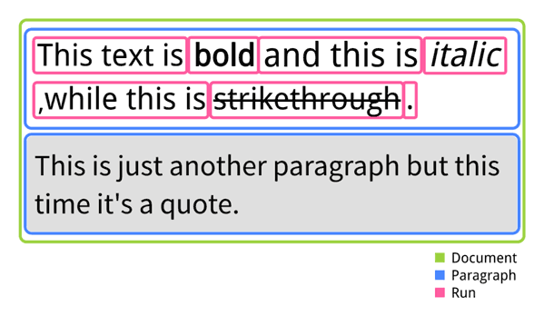

## Introducing a Way to transform Markdown to a Word document
The purpose of this post is to show a way to transform Markdown
to a Word document using Frameworks like [Apache POI](https://poi.apache.org/document/), 
[JSoup](https://jsoup.org/) and [Pegdown](https://github.com/sirthias/pegdown).
This blogpost will cover a simple example where a piece of markdown is transformed into a Word document. 
In this simple example I will show how simple markdown - formatting like **bold**, *italic* and ~~strikethrough~~ - can be transformed into a docx file.
## Markdown and Word documents
If you never faced markdown before, you can read everything about it at [daring fireball](https://daringfireball.net/projects/markdown/). To keep it short, Markdown is a markup language created for fast, easy formatting of text *on the fly*. Markdown lets the author format his text while writing it. So this:

`
This text is **bold** and this is *italic*, while this is ~~strikethrough~~. 
`

becomes:

>This text is **bold** and this is *italic*, while this is ~~strikethrough~~. 

As you might know, in Microsoft Word formatting text like this have extra buttons in menus. 
## Why transform Markdown to a Word document?
In an workflow management system like [Signavio Workflow](http://www.signavio.com/products/workflow/) we face the frontier of digital and non-digital age quite often. As we try to do everything digital, Markdown is our best friend when it comes to formatting text online, espacially in a workflow management system. However in everyday life we are working with a lot of non-techy guys who love using office products like the office suite provided by Microsoft or Google.
Sometimes these two worlds collide and in the event of clashing there should be a solution suitable for both worlds, leading directly into a markdown to docx transformer. 
## Transform simple markdown text to a Word document 
As mentioned in the introduction, the goal of this article shoule be to transform this:

`
This text is **bold** and this is *italic*, while this is ~~strikethrough~~. 
`

into this:


We need to take three steps from Markdown to docx:

1. Parse the markdown and create HTML
2. Parse the HTML 
3. Create a document from parsed HTML

Luckily the first two steps can quickly be done by using existing libraries. I used [Pegdown](https://github.com/sirthias/pegdown) for step 1 and [JSoup](https://jsoup.org/) for step 2, there is not really anything special to mention for this steps, so I will focus on explaining the structure of the outcome and how to use [Apache POI](https://poi.apache.org/document/). 

Libraries like Pegdown will create HTML like this:
```html
<p>This text is <strong>bold</strong> and this is <em>italic</em>, 
while this is <del>strikethrough</del>.</p>
```
Parsing this piece of HTML will result in a tree like this:

- HTML
  - HEAD
    - #text:
  - BODY
    - #text: 
    - P
      - #text: This text is 
      - STRONG
        - #text: bold 
      - #text: and this is 
      - EM 
        - #text: italic
      - #text: , while this is 
      - DEL 
        - strikethrough
      - #text: .
     
As we got this, we are ready to use Apache POI to create a docx document, but first lets have a look at the structure of a docx document as used by POI for this simple example.

A document contains multiple pargraphs which can contain multiple runs. A paragraph defines the styling of one part of the document, a good example might be a quote, which can have a grey background to outline the quote visually but also basic text is seperated in pargraphs. 

A run is defined by the same styling of words. In the earlier mentioned example the complete sentence is one paragraph (In the HTML part, this is marked by the `<p>` tag), while stylings made to the text itselfs becomes a run. So one could say a run is a group of words which have the same styling. The following scheme shows what I just described:



Following this schema leads to the following code:

```java

```
