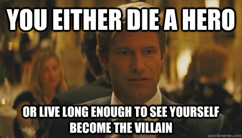
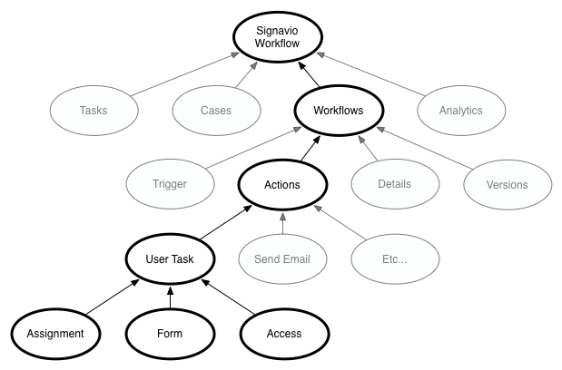
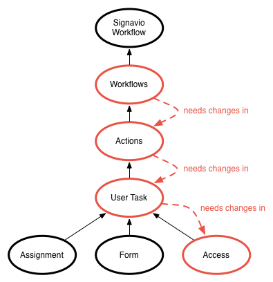
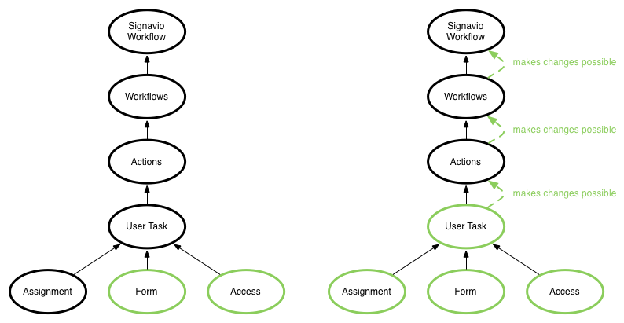

# Introduction
Hey there!
I'm Phil and I'm the Product Manager for Signavio Workflow.
To boost my credebility I'd like to mention that I started out as a frontend developer and still add my 2 cents in the Wolf Pack.
As a Product Manager I want my product to be top-notch with and up-to-date stack so that:

- Developers are happy
- We can deliver the best quality possible to our customers

However it turns out that constantily delivering new features and improvements can conflict with refactorings when they are approached in the wrong way.
The most commons problem we face is that refactorings become too large, thus take up many resources and block feature development for a longer period of time.
Obviously this is a no-go from my point of view.
In this blog post I want to show you how we deal with constant change and the legacy code it produces.

# What is legacy?

Over time I've come to the realisation that different people have a different understanding what _legacy code_ actually means.
In general I think legacy code is not inherently bad but just something that is part of every code base that lives long enough (read: longer than a month).

When I think of legacy code I mean one of the following:

- Dead code (code that isn't just in your application anymore)
- "Finished" code: features that change so little that they are not being refactored in a long time
- Too complex code that is very hard to change and therefore isn't changed
- Good, refactored code that needs to change because you
  - Changed your coding style
  - Changed something in the technology stack

# Think of your application as a tree

What helped me a lot when planning changes was to think of the application as a tree-like structure.
For instance Signavio Workflow is made up of different parts as the following image shows.
Here it is not important to understand exactly what each of these parts does but that every application is made up of different parts.

For now let's focus on the highlighted part.
In Signavio Workflow you can (as the name suggests) create workflows.
Those workflows consist of different actions and these actions can have different types.
One action would be a User Task which again has different configuration options like assignment, a form that needs to be filled out, and access restrictions.

## The Bad Way™

You want to refactor something on the _Workflows_ level and start right away.
As you code along you realise that the changes you just made also affect how _Actions_ need to be handled.
Since you already did a good amount of work and the system is now broken, you go ahead and start refactoring the _Actions_ as well.
One week later: You still aren't finished with your refactoring.
Now your changes to the _Actions_ also require changes in the different action types, such as our _User Task_.

What happened?

- One refactoring led to the other
- All those refactorings depend on another and cannot be included separately
- You constantly need to resolve conflicts as others still work on components deeper down the tree
- New features are halted because "There is a refactoring going on that changes everything anyways."
- Your colleagues get frustrated because you block them
- Your Product Manager gets frustrated because new stuff isn't being developed
- Everybody hates you.

## The Good Way™

You might already see where I'm going with this.
Instead of starting at the top of the tree, start at the bottom.

When you introduce changes from the bottom of your application tree, you can do that one node at a time.
For instance only once you refactored all configuration options of a _User Task_ you can tackle the component as a whole.
If all _Actions_ are refactored, you can go ahead and refactor the _Workflow_.
Working this way yields some nice benefits.

- All these refacorings can be included the moment they are finished
- You don't block feature development. For instance a colleague can still add things to the _Assignment_ section while you are working on the _Forms_
- Refactorings higher up in the tree are easier since all dependencies already have been refactored
- Your manager is happy because new features can still be done between refactorings

## Come up with a simple rule of thumb

What helped us get developers on track with this approach is to always offer a simple rule of thumb whether or not a file / component can be refactored.
For instance while we migrated from [Backbone](http://backbonejs.org/) views to [React](https://facebook.github.io/react/), we used the following rule:

> Does any of the components, the current component uses still rely on Backbone?

If yes, leave the component as-is. If no, refactor the component.

# Conclusion

In general I would recommend this approach to everyone working on larger software projects.
It helped us migrate from Backbone views to React.
It is currently helping us to move from Backbone models to [Redux](http://redux.js.org/).
The need to tackle large refactoring by coming up with a simple rule helped us slice work - if we cannot come up with a good rule, we question the task.
However, with each approach there are some pros and some cons.

## Pros

- If you add something at the bottom of the tree you can already use the new stuff
- Once some leaves have been refactored, refactoring the bigger node above is easy and just feels nice
- You can estimate the overall time needed, once you've finished some leaves.
  - Since you only refactor in small portions, your refactorings tend to be fast
- Feature development can still take place while refactoring

## Cons

- It can take a significant amount of time until the refactoring is done
  - You need to create visibility for ongoing refactoring projects and their progress
  - New refactorings can start while you are still working to get the first one going
    - Even though this might even save you some time
- You need to restrain yourself from starting "that big refactoring your always wanted to do"

# Related Work

- [Ryan Florence - Don't Rewrite, React!](https://www.youtube.com/watch?v=BF58ZJ1ZQxY)
