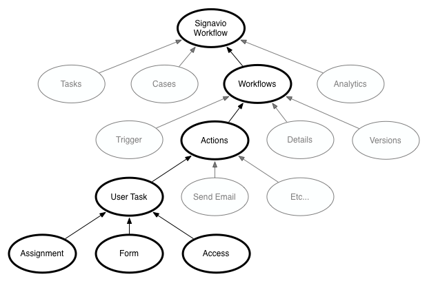
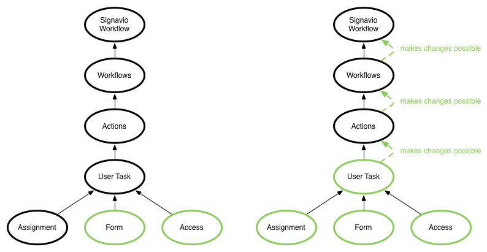

<a style="background-color:black;color:white;text-decoration:none;padding:4px 6px;font-family:-apple-system, BlinkMacSystemFont, &quot;San Francisco&quot;, &quot;Helvetica Neue&quot;, Helvetica, Ubuntu, Roboto, Noto, &quot;Segoe UI&quot;, Arial, sans-serif;font-size:12px;font-weight:bold;line-height:1.2;display:inline-block;border-radius:3px;" href="http://unsplash.com/@ethan520?utm_campaign=photographer-credit" target="_blank" rel="noopener noreferrer" title="Download free do whatever you want high-resolution photos from Ethan Ou"><svg xmlns="http://www.w3.org/2000/svg" style="height:12px;width:auto;position:relative;vertical-align:middle;top:-1px;fill:white;" viewBox="0 0 32 32"><title></title><path d="M20.8 18.1c0 2.7-2.2 4.8-4.8 4.8s-4.8-2.1-4.8-4.8c0-2.7 2.2-4.8 4.8-4.8 2.7.1 4.8 2.2 4.8 4.8zm11.2-7.4v14.9c0 2.3-1.9 4.3-4.3 4.3h-23.4c-2.4 0-4.3-1.9-4.3-4.3v-15c0-2.3 1.9-4.3 4.3-4.3h3.7l.8-2.3c.4-1.1 1.7-2 2.9-2h8.6c1.2 0 2.5.9 2.9 2l.8 2.4h3.7c2.4 0 4.3 1.9 4.3 4.3zm-8.6 7.5c0-4.1-3.3-7.5-7.5-7.5-4.1 0-7.5 3.4-7.5 7.5s3.3 7.5 7.5 7.5c4.2-.1 7.5-3.4 7.5-7.5z"></path></svg>Ethan Ou</a>

Hey there!
I’m Phil and I’m the Product Manager for Signavio Workflow.
To boost my credibility I’d like to mention that I started out as a front-end developer and still add my 2 cents in my team.
As a Product Manager I want my product to be top-notch with an up-to-date stack so that:

- Developers are happy
- We can deliver the best quality possible to our customers

However, it turns out that constantly delivering new features and improvements can conflict with re-factorings when they are approached in the wrong way.
The most common problem we face is that re-factorings become too large, thus take up many resources and block feature development for a longer period of time.
Obviously this is a no-go from my point of view.
In this blog post I want to show you how we deal with constant change and the legacy code it produces.

## What is legacy code?

Over time I’ve come to the realization that different people have a different understanding what _legacy code_ actually means.
In general I think legacy code is not inherently bad but just something that is part of every code base that lives long enough (read: longer than a month).

When I think of legacy code I mean one of the following:

- Dead code (code that isn’t used in your application anymore)
- ‘Finished’ code: features that change so little that they are not being re-factored in a long time
- Too complex code that is very hard to change and therefore isn’t changed
- Good, re-factored code that needs to change because you changed your coding style or changed something in the technology stack.

## Think of your application as a tree

What helped me a lot when planning changes was to think of the application as a tree-like structure.
For instance Signavio Workflow is made up of different parts as the following image shows.
It is not important to understand exactly what each of these components do but that every application is made up of different parts.

For now let’s focus on the highlighted part.
In Signavio Workflow you can (as the name suggests) create workflows.
Those workflows consist of different actions and these actions can have different types.
One action would be a User Task which again has different configuration options like assignment, a form that needs to be filled out, and access restrictions.

## The Bad Way™

You want to re-factor something on the _Workflows_ level and start right away.
As you code along you realize that the changes you just made also affect how _Actions_ need to be handled.
Since you already did a good amount of work and the system is now broken, you go ahead and start refactoring the _Actions_ as well.
One week later: You still aren’t finished with your refactoring.
Now your changes to the _Actions_ also require changes in the different action types, such as our _User Task_.

What happened?

- One refactoring led to the other
- All those re-factorings depend on another and cannot be included separately
- You constantly need to resolve conflicts as others still work on components deeper down the tree
- New features are halted because ‘There is a refactoring going on that changes everything anyway.’
- Your colleagues get frustrated because you block them
- Your Product Manager gets frustrated because new stuff isn’t being developed
- Everybody hates you.

## The Good Way™

You might already see where I’m going with this.
Instead of starting at the top of the tree, start at the bottom.

When you introduce changes from the bottom of your application tree, you can do that one node at a time.
For instance only once you re-factored all configuration options of a _User Task_ you can tackle the component as a whole.
If all _Actions_ are re-factored, you can go ahead and re-factor the _Workflow_.
Working this way yields some nice benefits.

- All these re-factorings can be included the moment they are finished
- You don’t block feature development. For instance a colleague can still add things to the _Assignment_ section while you are working on the _Forms_
- Re-factorings higher up in the tree are easier since all dependencies already have been re-factored
- Your manager is happy because new features can still be done between re-factorings

## Come up with a simple rule of thumb

What helped us get developers on track with this approach is to always offer a simple rule of thumb whether or not a file/component can be re-factored.
For instance while we migrated from [Backbone](http://backbonejs.org/) views to [React](https://facebook.github.io/react/), we used the following rule:

> Does any of the components, the current component uses still rely on Backbone?

If yes, leave the component as-is. If no, re factor the component.

But what happens when you notice too late and already started the refactoring?
There is a very simple answer to that: Roll back, think again, make a plan.
After that you can tackle the re-factoring from the right side and keep everyone happy.

## Conclusion

In general I would recommend this approach to everyone working on larger software projects.
It helped us migrate from Backbone views to React.
It is currently helping us to move from Backbone models to [Redux](http://redux.js.org/).
The need to tackle large re-factorings by coming up with a simple rule helped us slice work - if we cannot come up with a good rule, we question the task.
However, with each approach there are some pros and some cons.

Pros:

- If you add something at the bottom of the tree you can already use the new stuff
- Once some leaves have been re-factored, refactoring the bigger node above is easy and just feels nice
- You can estimate the overall time needed, once you’ve finished some leaves. Also, since you only re-factor in small portions, your re-factorings tend to be fast
- Feature development can still take place while refactoring

Cons:

- You need to restrain yourself from starting ‘that big refactoring your always wanted to do’
- It can take a significant amount of time until the refactoring is done

And because it can take time you need to create visibility for ongoing refactoring projects and their progress.
It also means that new re-factorings can start while you are still working to finish the first one.
However, this might even save you some time because the next re-factoring makes the old one obsolete.

## Related work

- [Ryan Florence - Don’t Rewrite, React!](https://www.youtube.com/watch?v=BF58ZJ1ZQxY)
- [The Mikado Method](https://mikadomethod.wordpress.com/)
- <https://pragprog.com/magazines/2010-06/the-mikado-method>
