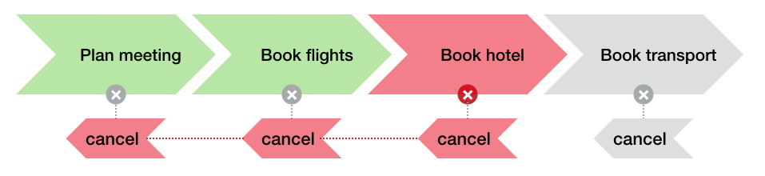
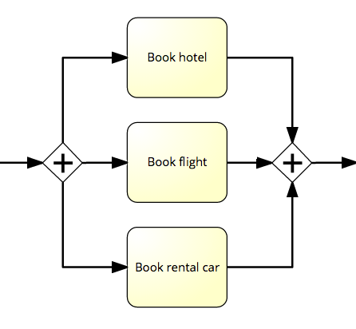
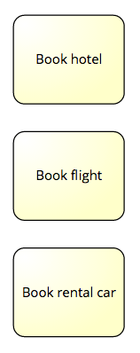

Comparing sagas to workflow helps to clarify the more subtle and hidden features of workflows
that are often overlooked.

## The saga failure compensation pattern

The term _saga_ was first used in 1987 in [a research paper by Hector Garcaa-Molrna
Kenneth Salem](http://www.cs.cornell.edu/andru/cs711/2002fa/reading/sagas.pdf).
It’s introduced as an conceptual alternative for long lived or distributed transactions.
A saga is a larger transaction that is split up into a set of smaller transactions.
This reduces the time that locks have to be held on database resources and therefore can
avoid bottlenecks.  Each of the smaller transactions can be undone by a compensating action.

If halfway through the large transaction has to be aborted, all smaller transactions that have
already completed have to be compensated for.  So in essence a saga is a failure pattern.

The simplest example to explain a saga is booking a business trip.  It’s split up in booking a hotel,
a flight and a car.  If it’s decided to abort the trip after a car and  hotel was booked,
those need to be cancelled.

Each step in the process has a corresponding _cancel_ action, triggered on failure, in reverse order.

## How sagas relate to workflows

A _workflow_, also known as a _business process_, is similar in the sense that it also defines a
larger task as a set of individual activities.  The cool part is that you most often can specify
graphically the ordering in which the activities have to be performed with arrows or transitions.
So the focus of a workflow is on execution.  A workflow specifies an execution flow.  An arrow
or transition is used to indicate that activities have to be executed sequentially.  Special
constructs like parallel gateways allow for parallel execution of activities.

When Sagas are mentioned in the context of CQRS, they refer to workflows or process managers from
the implementation perspective.  See
[_A Saga on Sagas_ by Microsoft](https://msdn.microsoft.com/en-us/library/jj591569.aspx) and
[_Sagas_ by Edument](http://www.cqrs.nu/Faq/sagas).

## Saga as inspiration for a workflow feature
There is already a great feature in Signavio Workflow that aligns nicely with the concept of sagas:
concurrent start activities.  In a workflow, all activities that do not have incoming transitions
are considered start activities and are started when the workflow starts.  To model a pure saga,
where the subtransactions are all atomic and have no dependencies, you can just add activities in
the workflow that are not connected with transitions like this:

And on top, I think it would be a great to have a compensation feature on activities in a
workflow system.  If the workflow gets cancelled or aborted, the activities already executed could
be compensated.  I think this isn’t a standard feature in most workflow systems because the focus
is on modeling those aspects that non technical people understand.  In BPMN it’s possible to model
compensation to some extent, but I think that is bad because technical details pollute the BPMN
diagram.  Nevertheless compensation on activity level and hidden from the diagram would be a great
feature for power users.

For example, if you specify sending an email as an activity in a workflow, you could also specify
a compensation email that is sent if later the workflow gets aborted.  When the activity is
uploading a file, you could remove it. And so on.  The feature would have to be optional because
in many use cases, compensation is not relevant.  But it would be great to have for those use cases
where it is relevant.

My conclusion is that if activity level compensation is available, workflows can be a great way
to implement sagas.
