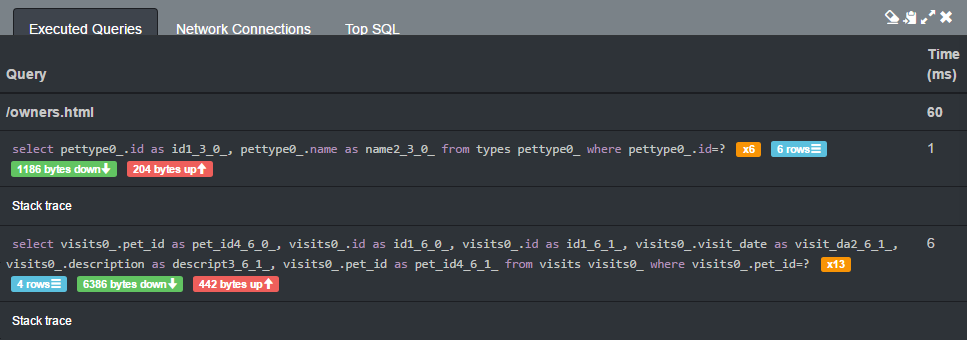

Having too many or slow database queries can slow down your application’s response time, which in turn impacts the user experience.
Slow response times can cause your users to quit using your application.
Therefore you should always test your application’s response time during development, in addition to functional testing.

In general development systems have a smaller data set compared to the production system, making the response time fast in development but slow in production.
So how can a developer identify a potential slow part of the application if flawed behavior depends on a larger database?

## Identifying SQL anti-patterns

[Sniffy](http://sniffy.io/) helps you to identify anti-patterns like the [N+1 Query Problem](https://secure.phabricator.com/book/phabcontrib/article/n_plus_one/) by listing all executed SQL queries of a Java web application directly in your browser.
If you want to play around and evaluate the features of Sniffy, you can visit a [live demo](http://demo.sniffy.io/owners?lastName=).

You should see a widget in the lower right corner showing you the page’s loading time and the number of SQL queries executed for the current site.


Selecting the Sniffy widget opens a detailed pop-up that shows the executed queries’ statements, the execution count per statement and the total execution time.
You can even open the stack trace to locate the execution in your code, so you can apply changes to optimize the query.



The list of executed queries combined with the execution count helps to identify anti-patterns like the N+1 Query Problem, where you have a high execution count but a low number of returned rows per statement.
The anti-pattern of loading several rows by ID in a loop can be replaced with one query with an `in` statement in the `where` clause taking multiple parameters.

Consider a simplified example where we want to get 10 rows in our result set.
The latency to the database server is 1 ms.
This time is added to each SQL statement to create a connection between the application server and the database.
The actual SQL query to find one row by ID needs 2 ms to get the result.
This makes _10 × 1 ms + 10 × 2 ms = 30 ms_ to get the complete result set of 10 rows for the row-based query in a loop.

The `in`-based query in our example needs also 2 ms for each returned row.
This makes _1 ms + 10 × 2 ms = 21 ms_ for the complete result set of the `in`-based query.
The latency is only applied once as all rows are returned by one query.
The `in`-based query needs 70 per cent of the time compared to the time that the row-based queries would need.

If we scale the example to expect 100 rows you get a feeling where this is going to in production.
The row-based queries needs _100 × 1 ms + 100 × 2 ms = 300 ms_ to get the complete result set where the `in`-based query only needs _1 ms + 100 × 2 ms = 201 ms_.
The `in`-based query now needs 67 per cent of the time that the row-based query would need.
In the first example the `in`-based query finishes 9 ms earlier, but in the second example the `in`-based query needs 99 ms less time in total.
In reality the execution time for the `in`-based query would normally not grow linearly with the number of requested IDs.
Because the SQL server can optimize the query and profit from an index the execution time would be even better than in our example.

The second query in the picture is executed thirteen times and the `where` clause is restricted by one ID.
It should be replaced with an `in` statement.


## Using Sniffy in your own application

To enable Sniffy in your own Java application follow the [set-up guide](http://sniffy.io/docs/latest/#_datasource).
If your application is deployed in Tomcat, set-up Sniffy like this:

1. Download `sniffy.jar` from the [Releases page on GitHub](https://github.com/sniffy/sniffy/releases/latest) and save it in your `<TOMCAT-HOME>/lib` folder
2. Add the `sniffy:` prefix to your database URL, e.g. `jdbc:mysql://localhost:3306/platform` becomes `sniffy:jdbc:mysql://localhost:3306/platform`
3. Change your database `DriverClass` to be `io.sniffy.sql.SniffyDriver` e.g. replace `com.mysql.jdbc.Driver`
4. Add the following filter definition and mapping to your `web.xml`

```xml
<filter>
    <filter-name>sniffer</filter-name>
    <filter-class>io.sniffy.servlet.SniffyFilter</filter-class>
    <async-supported>true</async-supported>
    <init-param>
        <param-name>enabled</param-name>
        <param-value>true</param-value>
    </init-param>
    <init-param>
        <param-name>inject-html</param-name>
        <param-value>true</param-value>
    </init-param>
</filter>
<filter-mapping>
    <filter-name>sniffer</filter-name>
    <url-pattern>/*</url-pattern>
</filter-mapping>
```

If you use [Spring Boot](https://projects.spring.io/spring-boot/), add the `@EnableSniffy` annotation to your `@SpringBootApplication` annotated class and add the following dependency.

Maven:

```xml
<dependency>
    <groupId>io.sniffy</groupId>
    <artifactId>sniffy-web</artifactId>
    <version>3.1.3</version>
</dependency>
```

Gradle:

```
dependencies {
    compile 'io.sniffy:sniffy-web:3.1.3'
}
```

## Summary and outlook

Sniffy shows the total response time of RESTful requests and database queries for one page directly in your browser.
In addition to the database feature described above, that lists the execution count and time of SQL statements, Sniffy can block requests to other servers (e.g. a database or third party service) to test your application’s fault tolerance.

You can also integrate Sniffy’s features in common [unit test frameworks](http://sniffy.io/docs/latest/#_unit_and_component_tests) to assert a maximum of executed SQL statements.
Sniffy is under active development on [GitHub](https://github.com/sniffy/sniffy) and distributed under [The MIT License](https://opensource.org/licenses/MIT), which makes it easy to use even for commercial projects.

In summary Sniffy is a nice tool for profiling your application’s response time, and is a free alternative to the commercial [XRebel](https://zeroturnaround.com/software/xrebel/) with a comparable feature set.
