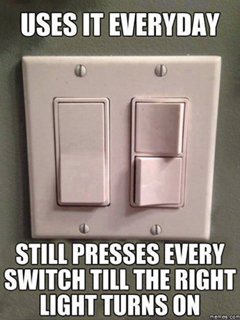
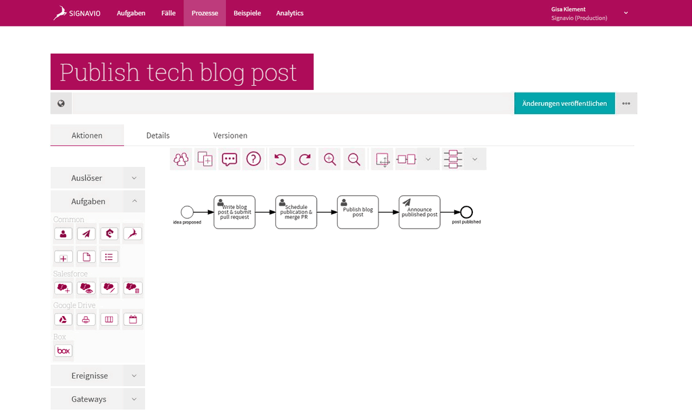

<a style="background-color:black;color:white;text-decoration:none;padding:4px 6px;font-family:-apple-system, BlinkMacSystemFont, &quot;San Francisco&quot;, &quot;Helvetica Neue&quot;, Helvetica, Ubuntu, Roboto, Noto, &quot;Segoe UI&quot;, Arial, sans-serif;font-size:12px;font-weight:bold;line-height:1.2;display:inline-block;border-radius:3px;" href="http://unsplash.com/@axellvak?utm_campaign=photographer-credit" target="_blank" rel="noopener noreferrer" title="Download free do whatever you want high-resolution photos from Remy_Loz"><svg xmlns="http://www.w3.org/2000/svg" style="height:12px;width:auto;position:relative;vertical-align:middle;top:-1px;fill:white;" viewBox="0 0 32 32"><title></title><path d="M20.8 18.1c0 2.7-2.2 4.8-4.8 4.8s-4.8-2.1-4.8-4.8c0-2.7 2.2-4.8 4.8-4.8 2.7.1 4.8 2.2 4.8 4.8zm11.2-7.4v14.9c0 2.3-1.9 4.3-4.3 4.3h-23.4c-2.4 0-4.3-1.9-4.3-4.3v-15c0-2.3 1.9-4.3 4.3-4.3h3.7l.8-2.3c.4-1.1 1.7-2 2.9-2h8.6c1.2 0 2.5.9 2.9 2l.8 2.4h3.7c2.4 0 4.3 1.9 4.3 4.3zm-8.6 7.5c0-4.1-3.3-7.5-7.5-7.5-4.1 0-7.5 3.4-7.5 7.5s3.3 7.5 7.5 7.5c4.2-.1 7.5-3.4 7.5-7.5z"></path></svg>Remy_Loz</a>

Hi, my name is Gisa and I am a front-end developer for [Signavio Workflow Accelerator](https://www.signavio.com/products/workflow/).
In this blog post I want to share some of the findings I made during my bachelor thesis in Business Computing at HTW Berlin.
Let’s start with a short intro about the topic and my approach to it, which consists of four steps:

1. Define
2. Observe
3. Report
4. Improve

The original title of the thesis _Anforderungsermittlung und Evaluation für die Neugestaltung der Benutzerschnittstelle für die Modellierungskomponente in Signavio Workflow_ translates to _Requirement identification and evaluation for the re-design of the user interface of the modelling component in Signavio Workflow_.
Handy, right?
In other words the thesis focused on analysing the current user interface in our process automation tool Signavio Workflow Accelerator.

 

To be more specific, I evaluated the user interface in the process modeler in Workflow Accelerator regarding our users’ needs and requirements.
I did this to discover potential weaknesses and develop solutions for alternative and improved interfaces.

## Define – find your (inner) user

To evaluate the current solution I started off by defining three different user types: the *Novice*, the *Expert* and the *Process Manager User*.
It is obvious that the first two mainly differ in their level of experience with the modeler's interface.
The Novice covers the behaviour users like Free-Trial-Users, students or basically anybody that just started to use Workflow Accelerator to model processes.
Whereas the Expert uses the application on a frequent basis, such as process owners and modellers.
But you might ask yourself where the Process Manager User comes in.

Well, the [Process Manager](https://www.signavio.com/products/process-editor/), one of Signavio’s other great products, and Workflow Accelerator share quite a few functionalities for related yet distinct purposes.
What they also share is a part of their customer base.
Often customers buy the Process Manager first and afterwards extend their licences to Workflow Accelerator.
Thus the user type Process Manager User stands for all users that a primarily familiar with Process Manager’s interface and its behaviour.

## Observe – find out what you usually miss

For each of the three user types I then found five real human representatives.
They each took part in individual test session where they let me observe them while working on simple modelling tasks I had given them to solve in Workflow Accelerator.
Thus I was able to observe their approach and interactions with the application in a pure manner and gather a ton of valuable conscious and unconscious feedback.

Without going too much into detail I want to share some of the seemingly obvious yet lacking findings I made during these test sessions.

## Report - findings by user type

The Novice expects more support when getting started.
What does that mean in particular? Some of the test users had gone right to the process modeler, skipping the trigger’s page.
After finishing modelling it was then unclear for them where to set the workflow trigger.
Furthermore they also expected the trigger to be represented by a graphic element rather than being a ‘setting’.

The Expert usually copes with large and complex process models.
It is essential for him to easily switch between views of the entire process model and a detail view.
There is also a noticeable need and desire for customizability, e.g. assembling a personal set of frequently used BPMN elements.

And ultimately the Process Manager User - he, as you might have guessed already, wants to be able to apply his knowledge and habits from the Process Manager to Workflow Accelerator.
That is absolutely understandable, especially since Signavio software keeps growing more and more into a platform rather than hosting individual software products.

But there are also findings that I was able to observe for all of the user types and that is how important the aesthetic appearance of a process model can be to the user.
More or less every test user I observed spent a noticeable amount of their time in rearranging and aligning the BPMN elements.
It certainly fits the saying ‘You eat with your eyes first’.

## Improve – matching your users’ needs

So these findings let me to develop a couple of prototypes and mock-ups that are targeted to solve the interface’s weaknesses.
The screenshots of the prototypes below show examples of a Process Manager inspired menu, a customizable set of BPMN elements, graphic trigger elements and much more functionality, e.g. support for aesthetic arrangements.

For the review I asked the same test users to meet me again.
The new designs of the interface were overall perceived very positively.
The feedback I got was again thoroughly valuable and will definitely be incorporated in iterative enhancements.

## Conclusion

So that wraps up the short summary of my thesis.
If you only remember one thing from this post, make it this one: Make sure to test your application, interfaces, and even features with people who meet your target group criteria.
These are the people that will eventually buy and use your product and should therefore be a solid component in development activities.

Happy testing!

## Recommended reading

[Jakob Nielsen - Why You Only Need to Test with 5 Users](https://www.nngroup.com/articles/why-you-only-need-to-test-with-5-users/)
