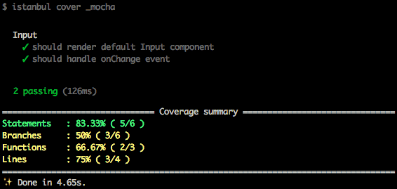
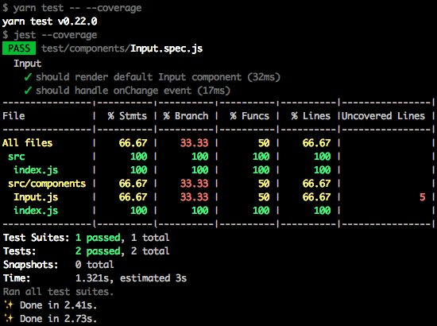

Since the big adoption of [Enzyme](https://github.com/airbnb/enzyme) to test React components, things got easier to test. Not so easy though is to choose the test assertion tool. Depending on the library you get, the more noisy dependencies you will eventually have to carry on along side your project in order to run, integrate and keep your tests passing.

As an example, I'm going to compare configuration, assertions and test coverage with [Mocha](https://mochajs.org/) and [Jest](https://facebook.github.io/jest/). The first one is currently known as simple, flexible and fun whereas the second got its popularity by becoming a painless JavaScript testing.

Also, I'm going to write some tests to the following (and yet simple) React component:

```javascript
import React from 'react'

const Input = ({ onChange, type = 'text', ...rest }) => (
  <input
    onChange={event => onChange && onChange(event.target.value, event)}
    type={type}
    {...rest}
  />
)

export default Input
```

## Mocha

Setting up Mocha itself is extremely easy. The flexibility it brings with different types of assertion libraries and the chance of working with [BDD](https://en.wikipedia.org/wiki/Behavior-driven_development) (Behavior Driven Development) definitely worth to mention here. Once it's installed, the first test is really simple to write and assert:

```javascript
import React from 'react'
import { shallow } from 'enzyme'
import assert from 'assert'

import { Input } from '../../src'

describe('Input', () => {
  var component

  beforeEach(() => {
    component = shallow(<Input />)
  })

  it('should render default Input component', () => {
    assert(component.html(), '<input type="text"/>')
  })
})
```

The hard part starts when we attempt to write the test in a real world fashion. Why? Mocha does not have mock, stubs nor a straightforward test coverage reporting tool. Also, it would be nice to write our tests in a friendly manner just like [chai](http://chaijs.com/) does for example. Hopefully, its [wiki](https://github.com/mochajs/mocha/wiki) provides us a big help so then we can start using the following add-ons:

1. babel-core and write ES6 syntax
2. chai as assertion library (feel free to use others)
3. [SinonJS](http://sinonjs.org/) to mock or stub extra dependencies
4. [Istanbul](https://github.com/gotwarlost/istanbul), [blanket](https://github.com/alex-seville/blanket), [mochify.js](https://github.com/mantoni/mochify.js) or any other tool for test coverage
5. [sinon-chai](https://github.com/domenic/sinon-chai) in case you want a nice experience when asserting event handlers

```bash
yarn add --dev mocha babel-core chai sinon istanbul sinon-chai
```

And the test will look like this:

```javascript
import React from 'react'
import { shallow } from 'enzyme'
import { spy } from 'sinon'

import { Input } from '../../src'

describe('Input', () => {
  let component

  beforeEach(() => {
    component = shallow(<Input />)
  })

  it('should render default Input component', () => {
    expect(component).to.exist
    expect(component.html()).to.equal('<input type="text"/>')
  })

  it('should handle onChange event', () => {
    const handleChange = spy()

    component.setProps({
      onChange: handleChange,
    })

    expect(handleChange).to.not.have.been.called

    const changeEvent = { target: { value: '123' } }
    component.simulate('change', changeEvent)

    expect(handleChange).to.have.been.called
    expect(handleChange).to.have.been.calledWith('123', changeEvent)
  })
  ...
})
```

### Coverage Report

Istanbul is also easy to install & use. We only need to tell it to run the report over Mocha and your report it's ready:



## Jest

Jest on the other hand is even easier to setup and furthermore less painful. In this case there's no need of chai, SinonJs, istanbul or any other extra additions to it, unless you need them of course. And as a plus it also includes the built-in [snapshot](https://facebook.github.io/jest/blog/2016/07/27/jest-14.html) testing.

The test assertions for the same component won't change that much:

```javascript
...
describe('Input', () => {
  it('should render default Input component', () => {
    expect(component).not.toBeNull()
    expect(component.html()).toBe('<input type="text"/>')
  })

  it('should handle onChange event', () => {
    const handleChange = jest.fn()

    component.setProps({
      onChange: handleChange,
    })

    expect(handleChange).not.toHaveBeenCalled()

    const changeEvent = { target: { value: '123' } }
    component.simulate('change', changeEvent)

    expect(handleChange).toHaveBeenCalledTimes(1)
    expect(handleChange).toHaveBeenCalledWith('123', changeEvent)
  })
  ...
})
```

### Coverage Report

Same as before, the coverage report will come up with the following result:



## Final Thoughts

After working for quite some time with Mocha, Jest became too good to be true and very productive when testing UI components. Not just because I could remove the boilerplate code around the tests on every new project I was working on, but also the test syntax was still the same or maybe very similar the one I'm already comfortable with. Change is always welcome as long as everyone can get a great benefit on that.

Afterwards, configuration got easier and test experience remains the same. However, it's also important to notice that Jest is a bit slower in performance when compared to Mocha due to the automocking feature. Obviously, please keep in mind that only installation and setup should not be a final call to decide whether choose test framework A B or C.

Afterwards, configuration got easier and test experience remains the same. However, it's also important to notice that Jest is a bit slower in performance when compared to Mocha due to the automocking feature. Obviously, please keep in mind that only installation and setup should not be a final call to decide between frameworks X, Y or Z.

Still, there isn't the right tool for the job. Most important than that is to choose the right tool for your team, so everyone can the get the most out of it.

> Systems that aren't testable aren't verifiable. Arguably, a system that cannot be verified should never be deployed.
>
> -- <cite>Robert C. Martin</cite> - Clean Code: A Handbook of Agile Software Craftsmanship

Peace out!