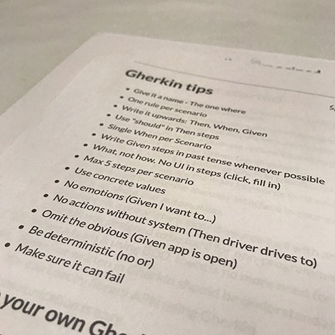

At the [ACCU 2017](https://conference.accu.org/) conference last week, [Seb Rose](https://twitter.com/sebrose) presented a 90-minute Behaviour-Driven Development (BDD) workshop on [Writing good BDD scenarios](https://conference.accu.org/site/stories/2017/sessions.html#XWritinggoodBDDscenarios).
This workshop was a great example of the excellent in-depth sessions from experts that I enjoyed attending at ACCU 2017.
This blog summarises what I learned.

## Feature scenarios

We started the workshop with two examples of feature scenarios, written in what we later learned to be a language called _Gherkin_.
The first scenario described an end-to-end cash withdrawal:

```gherkin
Scenario: Dispense $50 cash in multiple denominations
  Given I have $100 in my account
    And I have a card with the PIN 5173
    And I push my card into the machine
    And I enter 5173 for my PIN
    And I push the button next to Withdrawal
    And I push the button next to Checking
  When I push the button next to $50
  Then a $20 bill should be ejected by the cash dispenser
    And a $20 bill should be ejected by the cash dispenser
    And a $10 bill should be ejected by the cash dispenser
```

The second version described the same scenario, but focused on the specific business rule about which denominations to use:

```gherkin
Scenario: Dispense $50 cash in multiple denominations
  When $50 is dispensed by the ATM
  Then the following bills should be received:
    | count | denomination |
    | 2     | $20          |
    | 1     | $10          |
```

For the first exercise, we discussed the pros and cons for each version of the scenario.
Seb then cleverly tricked us into listing the benefits and disadvantages of each version, after which he explained why all of our observations about the long version were really disadvantages.
For example, we liked how the scenario included pre-conditions such as having enough money in the account, and how it describes a complete user interaction.
However, we learned that there are always more preconditions than you want to include, such as there being power to the ATM, so these are properly the subject of separate scenarios.
Similarly, our observations about the short version all turned out to be advantages.

Our first lesson was that feature scenarios that focus on a single business rule are better than end-to-end scenarios.
The latter include details that are best described in separate scenarios.
What wasn’t yet clear was how a single _feature_ description generally includes many independent _scenarios_.

The second lesson was that even such a simple scenario leads to a lively group _conversation_ while we _explored_ the scenario.
This was even more clear when we attempted to discuss another example, based on borrowing books from a public library.
It turns out that having a conversation about concrete examples is a key BDD technique.

## The Three Amigos

In BDD, _The Three Amigos_ refers to a conversation between a product owner, a developer and a tester about a feature.
(Apparently, the name comes from the 1986 American film [Three Amigos](https://en.wikipedia.org/wiki/Three_Amigos), which Seb assured us is terrible.)
This conversation should explore concrete examples in order to distill feature scenarios like the _Dispense $50 cash in multiple denominations_ scenario we had just looked at.

The benefit of this meeting, as we had just learned by actually doing, is that having this kind of conversation about a feature quickly unearths many different scenarios.
Even in the workshop setting, we understood that this identified scenarios far more quickly than if a developer had just started coding.

The third lesson was therefore that a short up-front conversation that includes business, implementation and QA perspectives can quickly identify functional scope, and any likely problems or areas that the business do not yet fully understand.
We also saw how you can write up the result of this discussion as scenarios using the _Given-When-Then_ structure that we recognise from unit tests, which is equivalent to _Arrange-Act-Assert_.
It turns out that this language is called _Gherkin_.

## Gherkin language

[Gherkin](https://github.com/cucumber/cucumber/wiki/Gherkin) is a simple language for describing features and test scenarios.
The _Given-When-Then_ encourages a structured approach to writing feature scenarios that all three amigos can understand.

Intriguingly, Gherkin’s grammar supports other [spoken languages](https://github.com/cucumber/cucumber/blob/master/gherkin/gherkin-languages.json), so you can also write _Given-When-Then_ as _Angenommen-Wenn-Dann_ or _Soit-Quand-Alors_ (or dozens of others).
The key point is that this is business language, which leads to the more important insight that Gherkin is designed to elicit that holy grail of Domain-Driven Design: the [ubiquitous language](https://en.wikipedia.org/wiki/Domain-driven_design#Building_blocks).

More broadly, Gherkin seems to be one of those ‘technologies’ whose low-tech simplicity hides its clever choices that make it so useful: in this case how it works for the business people.

## Gherkin tips

Another workshop exercise had us write scenarios in Gherkin for the public library example.
Writing Gherkin feature descriptions turns out to be harder than it might look, given the simplicity of the result.
At this point, Seb’s _Gherkin tips_ made a lot more sense:



As always, the thorny issue of naming appears, hence the first tip to use _Friends episode_ (television series) naming: _The one where the ATM dispenses cash_ or something.

## Next steps

Towards the end of the workshop, I was getting more curious about [Cucumber](https://github.com/cucumber/cucumber), which it had become clear that we weren’t going to cover.
As far as I can tell, Cucumber is a tool for executing Gherkin scenarios in the form of automated tests.
It turns out that Seb co-wrote a book about Cucumber - [The Cucumber for Java Book](https://pragprog.com/book/srjcuc/the-cucumber-for-java-book), so I guess I know what I have to do next.

<a title="The Cucumber for Java Book" href="https://pragprog.com/book/srjcuc/the-cucumber-for-java-book"></a>

One more thing: at one point, Seb told us that you can also use Gherkin to describe and test an API, rather than user-facing application functionality.
That sounds like a big topic all by itself that deserves further investigation.

_Photo: [Andy G](https://www.flickr.com/photos/andyg/5300333934) / [CC BY-SA 2.0](https://creativecommons.org/licenses/by-sa/2.0/)_
