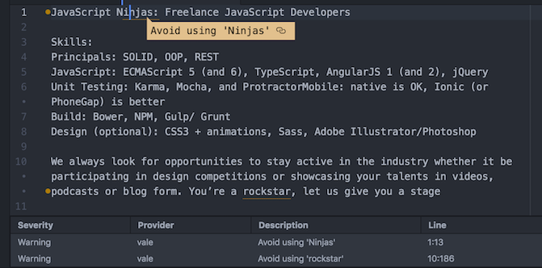

Natural language linters are command line tools that analyze written human language and check if the language complies with standard or custom writing rules.
This blog posts explains why natural language linters are useful and introduces two state-of-the-art natural language linting tools.

## Introduction to linters
As a programmer, you are most likely used to static code analysis tools (also known as *linters*), which automatically check some qualitative aspects of your code. If you’re not a programmer, here’s an example:


Code linters are similar to the spell/grammar checker of text processing software (below you see Microsoft Word):


The two language checkers differ from each other in the following aspects:

* The code linter analyzes [formal language](https://en.wikipedia.org/wiki/Formal_language), whereas the MS Word feature analyzes [human (natural) language](https://en.wikipedia.org/wiki/Natural_language).
* Most code linters use Unix-style open source technology that is plugged into an IDE or text editor.
 The analysis feature of Microsoft Word is proprietary and tied to Word and other Microsoft products.

A **natural language linter** has the technical properties of a code linter, but lints human language instead of program code.
Below you see a natural language linter that checks a semi-fictional job description for sensationalistic language.



You might ask yourself why people need tools like natural language linters if basic language-checking functionality comes with most text processing apps. The answers are: configurability and testability.

## Configurability
Natural language linters don’t only allow you to check text documents for compliance with a predefined set of rules; you can also define rules yourself.
The snippet below is an (incomplete) excerpt of a configuration that makes the [Vale linter](https://github.com/ValeLint/vale) check if a text complies with [E-Prime](https://en.wikipedia.org/wiki/E-Prime), a subset of the English language that doesn't use any form of *to be*:

```yml
extends: existence
message: "As a form of 'to be', '%s' doesn't comply with E-Prime."
ignorecase: true
level: error
tokens:
  - be
  - being
  - been
  - am
  - is
  - isn't
  - are
  ...(more tokens here)
```

For example, you can use custom rules to:

* ensuring you removed all occurrences of outdated product names,
* ensuring domain-specific terms are spelled correctly (it’s `JavaScript` and not `Java Script`),
* ensuring the consistent use of language (`click the button` vs `click on the button`).

## Automated testing
Most linters can run on any popular desktop or server operating system and provide machine-readable output.
This makes them great tools for automated testing.
Setting up a system that continuously checks your [Markdown](https://daringfireball.net/projects/markdown/)-based website content against your configured linter rules only requires standard test automation skills.
Still, a detailed explanation on how to do this might be worth its own blog post ;-)

## Technology overview
While natural language linters are still a niche phenomenon, a couple of them gained some traction during the last years.
I had a closer look at two of them:
* [write-good](https://github.com/btford/write-good), a Node.js module for natural language linting
* [Vale](https://github.com/ValeLint/vale), a command line tool written in Go

### write-good
write-good is fairly popular with 1000+ downloads per week and 2000+ GitHub stars (as of the time of writing).
As it's written in pure JavaScript, you can run it basically everywhere, which simplifies integration with other applications.
write-good supports a set of simple rules by default.
Further rules can be added as JavaScript modules that need to make extensive use of regular expressions.
Because of its difficult configuration setup and its limited natural language processing ability, write-good is not (yet) very powerful.
Given its limitations, I assume most of the traction write-good gets comes from JavaScript enthusiasts, who consider it a nice tool to play with, but won’t use it for serious text analysis.

### Vale
Vale is a (at the time of writing) relatively new tool and has recently gained some supporters in the technical writing community, most notably for its easy-to-use YML-based configuration files (as shown above).
While Vale is and not attracting many contributors - the average techie seems to shy away from writing Go - its core contributor is constantly improving the tool and even makes use of advanced natural language processing techniques like [sentence breaking](https://en.wikipedia.org/wiki/Sentence_boundary_disambiguation).
This lets me hope to see Vale evolve into a powerful tool for automated content quality checks.

## Conclusion: bleeding edge technology for automated content quality checks
Natural language linters allow you to configure custom formalized writing rules for text documents and set up automated tests to ensure the documents actually comply with these rules.
Natural language linters are still limited in their ability to conduct advanced text analysis.
Nevertheless, they are already useful to enforce basic writing rules in document sets like web pages generated with static site generators or manuals that are maintained with a [docs-as-code](http://www.writethedocs.org/guide/docs-as-code/) approach.

_Photo: [Nic McPhee](https://www.flickr.com/photos/nics_events/2349632625) / CC [BY-SA 2.0](https://creativecommons.org/licenses/by-sa/2.0/)_
