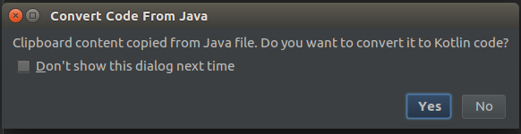
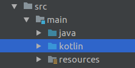

<a style="background-color:black;color:white;text-decoration:none;padding:4px 6px;font-family:-apple-system, BlinkMacSystemFont, &quot;San Francisco&quot;, &quot;Helvetica Neue&quot;, Helvetica, Ubuntu, Roboto, Noto, &quot;Segoe UI&quot;, Arial, sans-serif;font-size:12px;font-weight:bold;line-height:1.2;display:inline-block;border-radius:3px;" href="https://www.flickr.com/photos/dougtone/22049783033/in/photostream/" title="Doug Kerr flickr"><span style="display:inline-block;padding:2px 3px;"><svg xmlns="http://www.w3.org/2000/svg" style="height:12px;width:auto;position:relative;vertical-align:middle;top:-1px;fill:white;" viewBox="0 0 32 32"><title></title><path d="M20.8 18.1c0 2.7-2.2 4.8-4.8 4.8s-4.8-2.1-4.8-4.8c0-2.7 2.2-4.8 4.8-4.8 2.7.1 4.8 2.2 4.8 4.8zm11.2-7.4v14.9c0 2.3-1.9 4.3-4.3 4.3h-23.4c-2.4 0-4.3-1.9-4.3-4.3v-15c0-2.3 1.9-4.3 4.3-4.3h3.7l.8-2.3c.4-1.1 1.7-2 2.9-2h8.6c1.2 0 2.5.9 2.9 2l.8 2.4h3.7c2.4 0 4.3 1.9 4.3 4.3zm-8.6 7.5c0-4.1-3.3-7.5-7.5-7.5-4.1 0-7.5 3.4-7.5 7.5s3.3 7.5 7.5 7.5c4.2-.1 7.5-3.4 7.5-7.5z"></path></svg></span><span style="display:inline-block;padding:2px 3px;">Doug Kerr</span></a>

Recently, I decided to take [Kotlin](https://kotlinlang.org/ "Official Kotlin website") out for a spin as I had read so many positive things about the language.
I was also spurred on by the adoption of Kotlin as an official Android language.

Kotlin came about from JetBrains in 2011 and is a statically-typed programming language that runs on the JVM, and can also be compiled to JavaScript.
It is even getting a [native compiler](https://blog.jetbrains.com/kotlin/2017/04/kotlinnative-tech-preview-kotlin-without-a-vm/ "Kotlin native compiler announcement").

Coming from a Java background, the interoperability with Java interested me. I was also looking for a more concise language with more modern features that could allow for fast prototyping, with a low learning curve.
I have some experience with Scala but this felt too heavyweight, Python was also an option but in the end I needed to stay closer to the Java ecosystem for… reasons.
I decided to give myself a few hours a week over the period of a month to see if Kotlin would win me over.
The result was obvious pretty fast: I find it a joy to work in Kotlin.

## Interesting language features

Interoperability with Java: you can dip your toe gently into the Kotlin pool as it is trivial to call and use Java code in Kotlin and vice versa.
You simply have a Kotlin source folder alongside your Java, IntelliJ will even convert Java code into Kotlin for you!



Code can be expressed succinctly as a result of features such as data classes, default parameters for methods and constructors, reified generics, smart casts, and type inference.

Better [null safety](https://kotlinlang.org/docs/reference/null-safety.html "Null safety kotlin documentation") can be achieved through using non null types.
Working with potential nulls can also be written more succinctly through the safe call and Elvis operators, for example:
```kotlin
val country = person?.address?.country ?: "DE"
```

Would be something like this in Java:
```java
String country = person != null ? (person.getAddress() != null ? person.getAddress().getCountry() : "DE") : "DE";
```
Of course you would probably never do this; it’s not very nice to your co-workers.
You would probably use nested null check if statements instead:
```java
String country = "DE";
if(person != null){
    Address address = person.getAddress()
    if(address != null){
        country = address.getCountry();
    }
}
```

The Collections API is feature rich and not as verbose as the Java streams API.
Who hasn’t facepalmed repeatedly when typing:
```java
List<String> list = people.stream().map(Person::getName).collect(Collectors.toList());
```
Whereas in Kotlin:
```kotlin
val list = people.map { it.name }
```

What about building a map out of a list? In Java:

```java
Map<String, Person> nameToPerson =
    people.stream().collect(Collectors.toMap(Person::getName, Function.identity()));
```

Compared to:
```kotlin
val nameToPerson = list.associateBy({ it.name }, { it })
```

While researching I found an [excellent post comparing Java 8 stream equivalents](https://stackoverflow.com/documentation/kotlin/707/java-8-stream-equivalents#t=201607211216224974548) if you want a more detailed overview.

There are many other aspects I haven’t mentioned, however the above points were enough to make me want to get some hands on experience.

## Implementing a Dropwizard resource in Kotlin using jOOQ

We have a web service implemented in Java using the [Dropwizard framework](http://www.dropwizard.io/1.1.2/docs/ "Dropwizard website") and interacting with PostgreSQL via [jOOQ](https://www.jooq.org/ "jooq website").
I wanted to see if I could write our application code using Kotlin and so thought I would try implementing a simple resource which can create a row in a database table.

### Enabling Kotlin for an existing Java project

I work with IntelliJ as my IDE, using Gradle as the build tool.

To get started I just added some dependencies to my `build.gradle`:

```gradle
buildscript {
    ext.kotlin_version = '1.1.3-2'
    dependencies {
        classpath "org.jetbrains.kotlin:kotlin-gradle-plugin:$kotlin_version"
    }
}
apply plugin: 'kotlin'
dependencies {
    compile "org.jetbrains.kotlin:kotlin-stdlib-jre8:$kotlin_version"
    compile "org.jetbrains.kotlin:kotlin-reflect:$kotlin_version"
    compile "org.jetbrains.kotlin:kotlin-test:$kotlin_version"
    compile "com.fasterxml.jackson.module:jackson-module-kotlin:2.8.7"
}
```
I also added a new Kotlin source folder alongside my existing Java one.



Now we’re ready to write some code!

### Parsing inputs and outputs to JSON

Data classes are ideal for representing our JSON input and outputs. However, this means I need them to be parsed and mapped correctly to our database.

We achieved this in Java without writing too much code by using Lombok, Jackson and Java Persistence API (JPA) annotations.

It’s also quite straightforward with Kotlin:

```kotlin
import java.beans.ConstructorProperties
import java.util.*
import javax.persistence.Column

data class PersonInput(@Column(name = "c_address") val address: Address)

data class PersonOutput @ConstructorProperties("id", "address")
    constructor (@Column(name = "c_id") val id: UUID, @Column(name = "address") val address: Address)

data class Address(@Column(name = "c_country") val country : String)
```
I included the imports here so that it is obvious that I am using Java annotations in Kotlin code.
I like the fact that I can keep all these input and output objects in the same file without being restricted in the use of access modifiers.

Now I have fewer files and less code. Despite using Lombok annotations the Java code wasn’t as succinct as this.

I can use these classes in my existing Java resource if I want, in the exact same way I would use Java classes:
```java
@POST
@Consumes(MediaType.APPLICATION_JSON)
@ApiOperation(value = "Creates a person record")
@UnitOfWork
public PersonOutput create(PersonInput input) {
	return new PersonOutput(UUID.randomUUID(), new Address("UK"));
}
```
Here I am using all three of my Kotlin classes in Java. I simply have to import them as I would normal Java classes.

#### Enabling Jackson to parse Kotlin objects

The only thing I need to do in Java is to add a module to my Jackson `ObjectMapper`, so that the JSON gets parsed from and into Kotlin objects. I add this in my Dropwizard Application class.

```java
bootstrap.getObjectMapper().registerModule(new KotlinModule());
```

### Implmenting a resource in Kotlin

Now I want to implement the resource in Kotlin, and I want it to actually do something.

We are using jOOQ for object-relational mapping and so the first thing I want to do is write a simple Data Access Object (DAO).
We already have dependency injection in our existing code using Guice, and the jOOQ `DSLContext` is already available for injection.
We need to somehow get it into our DAO, and actually it turns out to be very easy:

```kotlin
class PersonDao @Inject constructor(private val dslContext: DSLContext) {

    fun create(input: Any): PersonRecord {
        val record = dslContext.newRecord(PERSON_TABLE, input)
        val stored = record.store()
        if (stored != 1)
            throw DataAccessException("Could not create record " + record)
        return record
    }
}
```

I only needed to use the normal guide `@Inject` annotation to get my `DSLContext`.
I could even have provided a default value for this parameter if I wanted to make unit testing simpler!

I decided to make the input type `Any` which is analogous to `Object`.
This is because it simplifies my service layer.

For my `PersonResource` I want to construct a `PersonOutput`.
jOOQ has a handy method on a record which will convert it into a given class.
I want my service object to be able to convert any type of record into its respective Output object.
I can use an inline function with a reified type parameter to achieve this:

```kotlin
class PersonService @Inject constructor(val dao: PersonDao) {
    inline fun <reified T> create(input: Any): T = dao.create(input).into(T::class.java)
}
```

There are a few things going on here.
I marked my function as `inline`: this means it [might be copied to the calling code instead of being an actual object itself](https://kotlinlang.org/docs/reference/inline-functions.html "Kotlin documentation on inline functions").
This then allows me to use `reified` to [access the type parameter at runtime](https://kotlinlang.org/docs/reference/inline-functions.html#reified-type-parameters "reified type parameter documentation").
This means I do not have to pass an instance of the class into the service and again just makes the code a bit tidier.

And now the resource itself:

```kotlin
@Api("Person Record Management")
@Path("/person/")
@Produces(MediaType.APPLICATION_JSON)
class PersonResource @Inject constructor(private val service: Service) {

    @POST
    @Consumes(MediaType.APPLICATION_JSON)
    @ApiOperation(value = "Creates a person record")
    @UnitOfWork
    fun create(@Valid input: PersonInput): PersonOutput {
        return service.create<PersonOutput>(input)
    }
}
```

Doesn’t look much different from the Java version!

## Debugging

Debugging a mixture of Kotlin and Java code so far feels identical to normal Java debugging in IntelliJ.

## Testing

You can again either use Kotlin libraries or use a mixture of Java and Kotlin.
I have even written some tests using JUnit5.

All I had to do was exactly what I had to do already for writing the tests in Java: simply add dependencies to my `build.gradle` for whichever test and assertion libraries I wanted to use, and use them!

It really was so simple there is not point in an example here.

## Wrapping up

Kotlin has lots of cool language features compared to Java.

In my Dropwizard resource I didn’t use too many of these features, however it was very easy to get a variety of Java frameworks and libraries to work with Kotlin (Dropwizard, jOOQ, guice, Jackson, JUnit5, AssertJ).

It’s trivial to call Java from Kotlin and vice versa.

Given all this I would happily start implementing new features in Kotlin.
