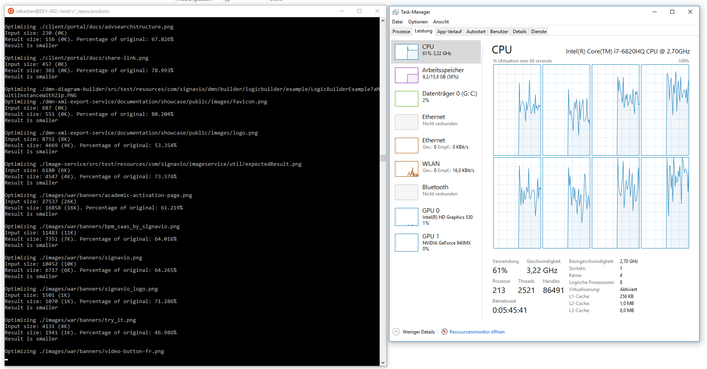
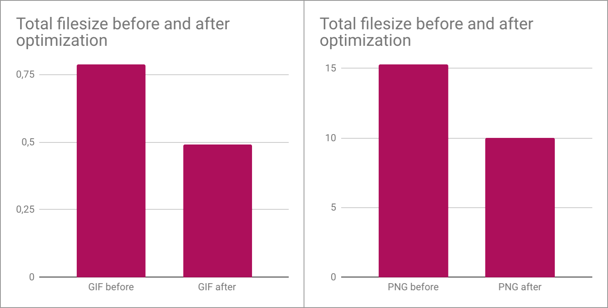

While modern web frontends already describe almost every tiny detail of a user interface through rules of CSS in company with bandwidth saving SVG graphics and web fonts, it was not that long ago that thousands of little raster images helped out to bring designs to life to a wide span of browsers.

Over the lifespan of a web application, this easily accumulates to a huge set of images. It immediately becomes legacy at the point of dropping support for certain old browsers and then cannot be transformed quickly. Even if there is in a long term perspective no way around tackling the cause, slight optimizations that work with the shotgun approach are always welcome.

Making use of state-of-the-art image compression while keeping full compatibility to traditional image decoders counts into that bucket and is the method that is going to shape my first blog post, taking some bigger portion of Signavio’s codebase as real world example.

# The situation given

After checking out the repo I performed a search to get a feeling of which files I should have a look into.

```
# find any PNG file, case-insensitive, count lines of the output
$ find . -iname '*.png' -type f | wc -l
```

Ok, there are around **2800 PNGs** and close to **700 GIFs**, but nearly no JPGs. Let’s get an impression of how much space this consumes in bytes.

```
# find any PNG file, case-insensitive, print total byte size
$ find . -iname '*.png' -type f -ls | awk '{sum += $7} END {print sum}'
```

PNGs are around **14.8 MB**, GIFs need another **0.75 MB** on top. The average PNG file is 5.4 KB, the average GIF 1.2 KB. But don’t be tricked by the numbers, there are a lot GIFs, that are just some pixels and this way only need some dozens of bytes, so on the other hand, there are definitely some bigger loader animation GIFs or PNG sprites.

I said it already, if GIF animation is used, it needs to be preserved if in place. The images come from various places, what means various encoders and people were involved over time, some of them probably cared about the size, some of them maybe also about generating spec compliant output, most likely none of them about color profiles, as these were long ignored by browsers and a mistake would have not even been visible.

# What is the low hanging fruit?

[Google’s Web Fundamentals](https://developers.google.com/web/fundamentals/performance/optimizing-content-efficiency/image-optimization) is a good read to start learning about image optimization. After also Googling around, I made a choice to use these tools:

**ZopfliPNG**: In the GZIP/Deflate compressor, another tool is hidden, that recompresses data within PNGs keeping compliance with Deflate. It also does some other optimizations, like removing metadata, leaving out color information for fully transparent pixels etc. but always producing the same final result.

[**Gifsicle**](http://www.lcdf.org/gifsicle/) is almost cross-platform available and is like a very advanced GIF editor that runs in a shell. It optimizes via compression as far as possible, but also allows for several minification strategies, like storing only the changed portion of each frame in animations, removing redundant colors and only embedding color tables that are really required.

Both tools are open source and free for (commercial) use.

# Working environment

For the sake of a better ecosystem, I am going to use the [Windows Subsystem for Linux](https://www.microsoft.com/en-us/p/ubuntu/9nblggh4msv6?activetab=pivot%3Aoverviewtab) in the flavor of Ubuntu. It’s quicker to set up than a true virtual machine and doesn’t require assigning reserved hardware resources (CPU cores, RAM etc.), because it can just run shared within the host system. As a consequence, all scripts here are fully compliant to a Bash environment on Linux. Yay, let’s go!

Install Gifsicle from the packet repositories; also _Git_, if you don’t have it at your fingertips already, as well as the _build-essential_ package to be able to create the binary from the Zopfli sources in one of the next steps.
```
$ sudo apt-get install gifsicle git build-essential
```

Make ZopfliPNG from sources …
```
$ git clone https://github.com/google/zopfli.git
$ cd zopfli
$ make zopflipng
```

… then copy to your ~/bin directory …
```
$ cp ./zopflipng ~/bin
```

… or softlink …
```
$ ln -s ./zopflipng ~/bin/zopflipng
```
… or make available via PATH in the way you prefer.

If ZopfliPNG runs fine, you should be able to print the help page included:
```
$ zopflipng -h

ZopfliPNG, a Portable Network Graphics (PNG) image optimizer.
Usage: zopflipng [options]... infile.png outfile.png
    zopflipng [options]... --prefix=[fileprefix] [files.png]...
[…]
```

# Working on Mac?

You probably prefer to just use brew to setup everything needed here instead of compiling by yourself. This is all you will need with `imagemagick` being optional for image conversion.

```
$ brew install zopfli gifsicle imagemagick
```

# Measure the outcome

Even if you not intend to write a blog post about your bandwidth savings, you probably always want to know where you started and what you achieved, like in any advertising sales show on TV comparing before and after side-by-side.

This line offers a speedy way to scan through all subfolders for matching files and count the bytes they consume. `-iname` matches case-insensitive, `type f` lists only files in the results, `-ls` makes `find` also list the file size, what saves us from accessing all matched files for that information twice. AWK adds the numbers together from the column 7, that is the file size in bytes. On a SSD, it took just 1-2 seconds for my scenario.

```
$ find . -iname '*.png' -type f -ls | awk '{sum += $7} END {print sum}'
```

I wondered how heavily images are reused in the codebase and how that makes a difference for judging the outcome. After extending the `awk` script part a little, I get a nice report in one go.

```
$ find . -iname '*.png' -type f -ls | \
  awk 'gsub(/^.+\//, "", $11)' | \
  awk '!seen[$11]++ {u_cnt++; u_sum+=$7}
       {i_cnt++; i_sum+=$7}
       END {printf "files: %s\nfiles unique: %s\nbytes total: %s\nbytes unique: %s\n",
            i_cnt, u_cnt, i_sum, u_sum}'
```
_Disclaimer: I assume that the comparison on filename basis is enough to find duplicates, as it is just for reporting. If you need to test it more carefully, let find execute a hash program per file and filter with awk on that basis._

Running on the unchanged files, it reports:
```
$ find . -iname '*.png' …
files: 2823
files unique: 1770
bytes total: 15318909
bytes unique: 10340967

$ find . -iname '*.gif' …
files: 673
files unique: 234
bytes total: 789844
bytes unique: 295223
```

Just for you, my dear reader, I also included a time measure for the script, that will run ZopfliPNG in parallel, so you can get an impression of how slow or fast it is, before unboxing it on your own machine.

# Optimize all GIFs

Now is finally the moment to hit the magic button. Alter the number behind `-P` according to the threads you want to run in parallel. I use a notebook that comes with 8 virtual CPU cores. To be able to still use the computer while letting it compute, I limited it to half.

```
$ find . -iname '*.gif' -type f -print0 | xargs -0 -P4 -I{} gifsicle --batch --optimize=3 {}
```

It isn’t very verbose, as `xargs` runs a sub-shell per file. For me it took a minute or two to run through the 673 files. It reported some errors in regard to _irregular_ files, which I am going to have a look at later in the article.

# Optimize all PNGs

ZopfliPNG is a little more of a quick and dirty kind of tool, so compression takes longer than the optimization of GIFs and to really let it run as batch job, it needs some script assistance. Here is what I put together and finally worked well.

```
#!/bin/bash
# License CC-0: https://creativecommons.org/publicdomain/zero/1.0/

# batch zopfli compression, use like (from your working root folder):
# $ find . -iname '*.png' -type f | ~/your/path/to/batch-zopflipng.sh

# write a recompressed file to the temp dir, move when finished
fn_recompress() {
	# use local variable for thread safety
	local tmpfile=$(mktemp)

	# encode
	zopflipng -m -y --lossy_transparent $1 $tmpfile

	# move tempfile if there is one and size is greater than zero
	# it’s the case zopfli was actually able to compress better
	if [ -s $tmpfile ]; then
		mv $tmpfile $1
	else
		rm $tmpfile
	fi
}

# make custom function available in subshell
export -f fn_recompress

# time tracking
start_time=$(date +%s)

# run font scans in parallel (8 cores)
xargs -n1 -P4 -I{} bash -c 'fn_recompress $1' _ {}

# time tracking result
end_time=$(date +%s)
echo "execution time was $(expr $end_time - $start_time)s."
```

It basically creates a temporary file and hands over to ZopfliPNG. There is a little strange behavior, that it does not accept directly overwriting the file, but also only writes the new file if final file size is smaller than the original PNG, producing an empty temporary file otherwise. That’s why the script only writes back if the temporary file is not empty.

This whole procedure is wrapped into a function to use one local variable (file handle) per thread, which enables `xargs` again to do its job for parallelization. ZopfliPNG itself seems to run single-threaded only. Again I use `-P4` to use 4 cores.

Please be aware, that you probably run into errors when running the script in alternative shells, the shell needs to have support for exporting a function to a sub-shell, the `#!/bin/bash` is on purpose to make that happen. The script expects `zopflipng` in your PATH.

Get the script running with pipelining a list of files to it:
```
$ find . -iname '*.png' -type f | ~/your/path/to/batch-zopflipng.sh
```



While keeping it working in the meantime, in my case the script took around 32 minutes to process all 2823 PNGs.

# The moment of truth

Ok, so let’s see whether this little journey finally pays off, strictly speaking for my particular use case:



* 98% (2762 of 2823) of the PNGs were actually affected by a better compression
* PNGs shrinked in total from 14.77 to 9.53 Mbytes ~ 35% saved
* all of the GIFs were changed (lets me assume that gifsicle had found something to optimize)
* GIFs shrinked in in total from 771 to 480 KB ~38% saved

If you read carefully, you may notice that even though I realized that there are only 35-60% unique files it is just easier to simply treat them all as unique files, compared to tracking all the locations to write back duplicates.

It turned out, that the relative savings in size are quite linearly distributed, which means it does not make a big difference to calculate on unique files only or include them all.

```
GIF bytes total: 491765 (0.28 MB - 37.7% saved)
GIF bytes unique: 195734 (0.09 MB - 33.7% saved)
PNG bytes total: 9996745 (5.08 MB - 34.7% saved)
PNG bytes unique: 6767325 (3.41 MB - 34.6% saved)
```

# Fix errors

An exciting finding comes with 3 errors gifsicle reported, in the fashion of

```
gifsicle:./menu-large.gif: file not in GIF format
```

A quick check with `file --mime-type menu-large.gif` revealed that it is actually a PNG with a wrong extension. It seems to never cause a problem, being automatically decoded the right way by the browsers. To actually turn them into real GIFs, we can use the ImageMagick converter.

```
$ sudo apt-get install imagemagick imagemagick-doc
```

After installing, just use `convert` to decode a problematic image that can have nearly any image format one can think of and pass the decoded image directly into gifsicle to meet our high compression standard:

```
$ convert menu-large.gif GIF:- | gifsicle --optimize=3 > menu-large.gif
```

That was quick! And is the lucky end of my first Tech Blog post.

# About the author

I am Sebastian, working already for a couple of years at Signavio as a designer looking into various fields over time and currently settled in the Engineering department. I especially enjoy digging deeply into details of a problem and make an excursion into programming from time to time.

# Resources

* [Google’s Web Fundamentals - Image optimization](https://developers.google.com/web/fundamentals/performance/optimizing-content-efficiency/image-optimization)
* [Google’s Web Fundamentals - Automating image optimization](https://developers.google.com/web/fundamentals/performance/optimizing-content-efficiency/automating-image-optimization/)
* [GitHub repository for Google’s Zopfli](https://github.com/google/zopfli)
* [Gifsicle Man page](https://www.lcdf.org/gifsicle/man.html)
* [How to install Windows Subsystem for Linux](https://docs.microsoft.com/en-us/windows/wsl/install-win10)

<a style="background-color:black;color:white;text-decoration:none;padding:4px 6px;font-family:-apple-system, BlinkMacSystemFont, &quot;San Francisco&quot;, &quot;Helvetica Neue&quot;, Helvetica, Ubuntu, Roboto, Noto, &quot;Segoe UI&quot;, Arial, sans-serif;font-size:12px;font-weight:bold;line-height:1.2;display:inline-block;border-radius:3px" href="https://unsplash.com/@diesektion?utm_medium=referral&amp;utm_campaign=photographer-credit&amp;utm_content=creditBadge" target="_blank" rel="noopener noreferrer" title="Download free do whatever you want high-resolution photos from Robert Anasch"><span style="display:inline-block;padding:2px 3px"><svg xmlns="http://www.w3.org/2000/svg" style="height:12px;width:auto;position:relative;vertical-align:middle;top:-1px;fill:white" viewBox="0 0 32 32"><title>unsplash-logo</title><path d="M20.8 18.1c0 2.7-2.2 4.8-4.8 4.8s-4.8-2.1-4.8-4.8c0-2.7 2.2-4.8 4.8-4.8 2.7.1 4.8 2.2 4.8 4.8zm11.2-7.4v14.9c0 2.3-1.9 4.3-4.3 4.3h-23.4c-2.4 0-4.3-1.9-4.3-4.3v-15c0-2.3 1.9-4.3 4.3-4.3h3.7l.8-2.3c.4-1.1 1.7-2 2.9-2h8.6c1.2 0 2.5.9 2.9 2l.8 2.4h3.7c2.4 0 4.3 1.9 4.3 4.3zm-8.6 7.5c0-4.1-3.3-7.5-7.5-7.5-4.1 0-7.5 3.4-7.5 7.5s3.3 7.5 7.5 7.5c4.2-.1 7.5-3.4 7.5-7.5z"></path></svg></span><span style="display:inline-block;padding:2px 3px">Robert Anasch</span></a>
