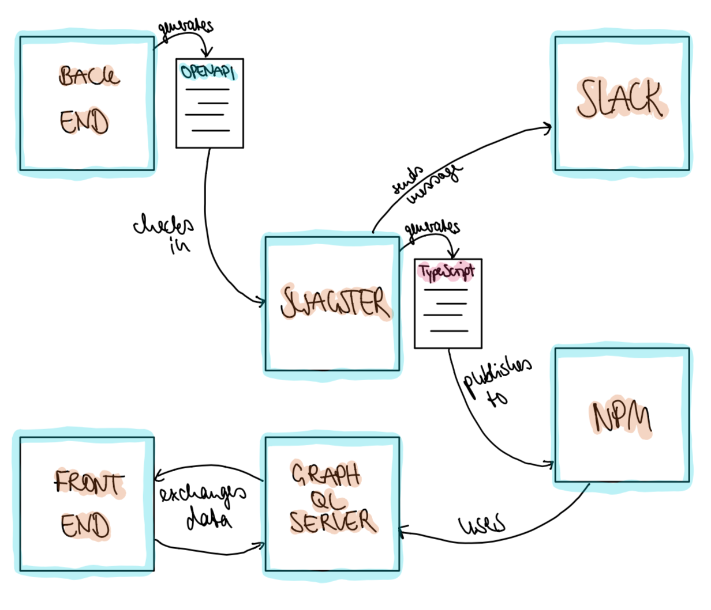

As in many companies, our team combines both frontend and backend developers, more or less keen on residing in their respective engineering domain. We have a Java Backend exposing a REST-API that is consumed by an [Apollo GraphQL server](https://www.apollographql.com/docs/apollo-server/). These two services need to agree on an API. To avoid too much conversational incentive, in usually short meetings we define the API's endpoints.

Often enough, we face problems when the agreement made is not entirely followed through or interpreted differently by one of the involved parties. Thus being motivation to come up with a way to achieve _certainty_ about what is to be expected on both ends of the deal.

### I am a developer in Signavio's [Process Intelligence](https://www.signavio.com/products/process-intelligence/) product and I want to present you an idea how to attain said certainty. Basically, how to type an API end-to-end.

There are several things constantly enhancing my desire to work as a developer. Few beat my affection for slack bots and seemingly random acronyms. Unsurprisingly, the project's name was created long before most of the confluence page mapping out its future approach.

### SWAGSTER: Swagger Safe Typing Evaluation Repository.


For everyone not familiar with [Swagger.io](https://swagger.io/), it is essentially a library that allows you to annotate your API related Java code to later on generate fancy overviews amongst other probably more relevant features (e.g. converts well to Postman).

With the generous help of a gradle plug-in simply called [_swagger-gradle-plugin_](https://github.com/swagger-api/swagger-core/tree/master/modules/swagger-gradle-plugin) and a corresponding gradle task, we are able to generate an OpenAPI JSON that is easily understood by _Swagster_.

```java
resolve {
    outputFileName = 'open_api_schema'
    outputFormat = 'JSON'
    prettyPrint = 'TRUE'
// ...
}
```

In our NodeJS clad GraphQL server, we needed to get rid of the uncertainty JavaScript tends to provide in regards of typing, replacing it with another popular superset, namely TypeScript.

After freshly and therefore continuously creating the OpenAPI JSON in our backend's CI pipeline, we use git to check in the JSON to the _Swagster_ repo, where a CircleCI build job is triggered we mainly abuse as its remote interface, activating the pipeline in _Swagger_.

### Now, the fun part begins.

[_openapi-diff_](https://www.npmjs.com/package/openapi-diff) is an npm package designed to differentiate between two given files. Don't be fooled by their documentation, you can run it just as much from your node environment as from the command line.
We make use of that letting it identify for us, whether changes were made to the API.

If this turns out positive, we utilize the [_ts-morph_](https://www.npmjs.com/package/ts-morph) package to convert the transmitted OpenAPI JSON file to TypeScript through code generation.
There, we extract the endpoints' information putting it into the functions of a new `class` extending the [`RESTDataSource`](https://www.apollographql.com/docs/apollo-server/features/data-sources/) provided by Apollo. The `RESTDataSource` comes with caching, reduction of redundancies and error handling out of the box, which is obviously helpful.

### Example

Take this as part of the API specification in your OpenAPI file:

```json
"paths" : {
    "/houseelf/{houselfid}" : {
      "get" : {
        "operationId" : "getHouseElf",
        "parameters" : [ {
          "name" : "houselfid",
          "in" : "path",
          "required" : true,
          "schema" : {
            "type" : "string"
          }
        } ],
      "responses" : {
          "default" : {
            "description" : "default response",
            "content" : {
              "application/json" : {
                "schema" : {
                  "$ref" : "#/components/schemas/HouseElf"
                }
              }
            }
          }
        }
      }
    }
}
```

This is how it then looks like within our `RestDataSource` class:

```javascript
/*
 *  GET '/houseelf/{houseelfid}'
 */
getHouseElf(houselfid: string): Promise<Components.Schemas.HouseElf> {
    return this.get(`/houseelf/${houseelfid}`)
}
```

At the moment, we have our types produced by the npm package _dtsgen_ as in here:

```
yarn dtsgen --out src/types.d.ts src/open_api_schema.json
```

Meanwhile a Slack message is generated enumerating the endpoints that underwent alteration, which is then send to our monitoring channel. I normally add some Rick and Morty emojis here for good measure.

Eventually, the newly generated TypeScript code is published to both the _Swagster_ repository on git and npm.



### Outcome

Your API changes highly increase in visibility being reported to Slack.
Also reminding you to manually update the GraphQL server's _Swagster_ npm package to apply its output to the GraphQL resolvers.

There it comes in handy to experience type warnings through TypeScript in case you missed a change to the API.

_Swagster_ immensely reduces boiler plate code in the GraphQL server and also feels inherently safe with code generation being the means of implementation.

Thereby successfully concluding the type safety certainty effort from backend to GraphQL server to frontend.
