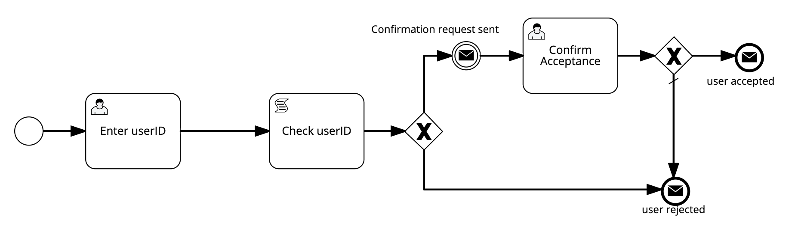

In this blog post, we show how to execute BPMN 2.0 XML diagrams on Hyperledger Fabric, using the *Caterpillar* engine or our newly created *[BPMN-Sol](https://www.npmjs.com/package/bpmn-sol/v/0.0.3)* compiler (which is in turn based on the BPMN 2.0 XML to Solidity compiler of Caterpillar).

## BPX on the Blockchain with Caterpillar
The intersection of blockchain technology and business process management has recently received increased attention by the academic community.
One of the research results is the [Caterpillar](https://github.com/orlenyslp/Caterpillar) engine, a prototype that can compile BPMN 2.0 XML diagrams (with some restrictions) to Solidity smart contracts and execute them on the Ethereum blockchain.
This means, Caterpillar allows business users to specify smart contracts graphically as flowchart-like *BPMN* diagrams; now, you don't need to be a coder to write smart contracts!


<p align="center">A sample BPMN diagram that can be deployed as smart contract</p>

## Why Hyperledger Fabric matters
By default, Caterpillar integrates with Ethereum (and the Ethereum [Ganache client](https://www.trufflesuite.com/ganache)), which is problematic because Ethereum is typically not considered suitable for Enterprise use cases:

* Ethereum's transaction costs and price fluctuations add unwanted volatility to the business environment.
* The association with *snake oil* schemes and ICOs, as well as the unchecked influence of one individual project lead decrease the willingness of serious enterprises to belief in the long-term sustainability of the ecosystem.

In contrast, the [Hyperledger Fabric](https://www.hyperledger.org/projects/fabric) framework implements a [consortium blockchain](https://hedgetrade.com/blockchain-consortium/) approach: it limits network participation to authenticated parties that are willing to participate in consensus-finding without additional (on-chain) financial incentives.
This makes cryptocurrency features and transaction costs obsolete. 

Also, Hyperledger is backed by well-known industry giants like SAP and IBM, and managed by the Linux Foundation, which provides a comparably high degree of institutional trust.

## Getting it running
The following instructions explain how to execute BPMN 2.0 XML diagrams on Hyperledger Fabric, using the open source tool *Caterpillar*. It is also possible to compile the BMPN 2.0 XML using the [BPMN-Sol compiler](https://github.com/signavio/BPMN-Sol) and deploy to Hyperledger. Both the methods are provided below.


### Prerequisites for this demo

- [Go](https://golang.org/dl/) (version 1.11.1)
- [Docker](https://www.docker.com/) (version 17.06.2-ce or greater)
- [Node](https://nodejs.org/en/) (version 8.9.x or greater)
- [npm](https://www.npmjs.com/) (version 5.6.0)

### Setting up the Hyperledger network

In this step, we will set up fabric locally using docker containers, install the EVM chain code (EVMCC) and instantiate the EVMCC on our fabric peers. This step uses the Hyperledger [fabric-sample](https://github.com/hyperledger/fabric-samples) repo to deploy fabric locally and the [fabric-chaincode-evm](https://github.com/hyperledger/fabric-chaincode-evm) repo for the EVMCC, Fab3 and Fab3.  This step follows the [fabric-chaincode-evm tutorial](https://github.com/hyperledger/fabric-chaincode-evm/blob/master/examples/EVM_Smart_Contracts.md) closely.

### Clean docker and set GOPATH

This will remove all your docker containers and images!
```
docker stop $(docker ps -a -q)
docker rm $(docker ps -a -q)
docker rmi $(docker images -q) -f
```

Make sure to set GOPATH to your *go* installation and that your path variable is updated accordingly:
```
export GOPATH=$HOME/go
export PATH=$PATH:$GOPATH/bin
```

Create the path ``$GOPATH/src/github.com/hyperledger/``

### Get Fabric Samples and download Fabric images

Clone the [fabric-samples](https://github.com/hyperledger/fabric-samples) repo in your `GOPATH/src/github.com/hyperledger` directory:
```
cd $GOPATH/src/github.com/hyperledger/
git clone https://github.com/hyperledger/fabric-samples.git
```

Checkout `release-1.4`
```
cd fabric-samples
git checkout release-1.4
```

Now run the following command: </n>
```
curl -sSL http://bit.ly/2ysbOFE | bash -s

```
This will install all the binaries which are required to setup the Hyperledger network locally. </n>

### Mount the EVM chain code and start the network

Clone the [fabric-chaincode-evm](https://github.com/hyperledger/fabric-chaincode-evm) repo in your GOPATH directory.
```
cd $GOPATH/src/github.com/hyperledger/
git clone https://github.com/hyperledger/fabric-chaincode-evm
```

Checkout `release-0.1`
```
cd fabric-chaincode-evm
git checkout release-0.1
```


Now, navigate back to your ``fabric-samples`` folder.  Here we will use the *first-network* example to launch the network.
```
cd $GOPATH/src/github.com/hyperledger/fabric-samples/first-network
```

Update the `docker-compose-cli.yaml` and include ``fabric-chaincode-evm`` in the list of *volumes*.

```
  cli:
    volumes:
      - ./../../fabric-chaincode-evm:/opt/gopath/src/github.com/hyperledger/fabric-chaincode-evm
```

Generate certificates and bring up the network
```
./byfn.sh generate
./byfn.sh up
```

### Install and Instantiate EVM chain code

Navigate into the cli docker container:

```
docker exec -it cli bash
```

If successful, you should see the following prompt:
```
root@0d78bb69300d:/opt/gopath/src/github.com/hyperledger/fabric/peer#
```

To change which peer is targeted change the following environment variables:
```
export CORE_PEER_MSPCONFIGPATH=/opt/gopath/src/github.com/hyperledger/fabric/peer/crypto/peerOrganizations/org1.example.com/users/Admin@org1.example.com/msp
export CORE_PEER_ADDRESS=peer0.org1.example.com:7051
export CORE_PEER_LOCALMSPID="Org1MSP"
export CORE_PEER_TLS_ROOTCERT_FILE=/opt/gopath/src/github.com/hyperledger/fabric/peer/crypto/peerOrganizations/org1.example.com/peers/peer0.org1.example.com/tls/ca.crt
```

Next, install the EVM chain code on all the peers:
```
peer chaincode install -n evmcc -l golang -v 0 -p github.com/hyperledger/fabric-chaincode-evm/evmcc
```

Instantiate the chain code:

```
peer chaincode instantiate -n evmcc -v 0 -C mychannel -c '{"Args":[]}' -o orderer.example.com:7050 --tls --cafile /opt/gopath/src/github.com/hyperledger/fabric/peer/crypto/ordererOrganizations/example.com/orderers/orderer.example.com/msp/tlscacerts/tlsca.example.com-cert.pem
```

Great.  You can exit out of the cli container and return to your terminal.
```
exit
```

You are now ready to setup Fab3.


### Set up Fab3

**Open a new terminal window** and execute the following to set certain environment variables required for setting up Fab3.

```
export FABPROXY_CONFIG=${GOPATH}/src/github.com/hyperledger/fabric-chaincode-evm/examples/first-network-sdk-config.yaml # Path to a compatible Fabric SDK Go config file
export FABPROXY_USER=User1 # User identity being used for the proxy (Matches the users names in the crypto-config directory specified in the config)
export FABPROXY_ORG=Org1  # Organization of the specified user
export FABPROXY_CHANNEL=mychannel # Channel to be used for the transactions
export FABPROXY_CCID=evmcc # ID of the EVM Chaincode deployed in your fabric network
export PORT=8545 # Port the proxy will listen on. If not provided default is 8545.
```

Navigate to the `fabric-chaincode-evm` cloned repo:
```
cd $GOPATH/src/github.com/hyperledger/fabric-chaincode-evm/
```
Run the following to build the fab proxy:
```
make fab3
```
You can then run the proxy:
```
bin/fab3
```

This will start Fab3 at `http://localhost:8545`.
You should see output like the following:
```
{"level":"info","ts":1550530404.3546276,"logger":"fab3","caller":"cmd/main.go:143","msg":"Starting Fab3","port":8545}
```
Now we have successfully set up the local Hyperledger network. The next step is to start the Caterpillar engine. 

### Method 1:Caterpillar engine

Open a new terminal and run the Caterpillar docker image with ``docker run --rm -it -p 3200:3200 -p 3000:3000 -p 8090:8090 gowthammohan/caterpillarmodified``.
Note that we provide and use a customized version of the Caterpillar v1 engine.
After the caterpillar engine has started, the execution panel, which lets us to interact with the engine, is now available at ``http://localhost:3200``.


Go to the execution panel at ``http://localhost:3200``.
Here you can either upload a BPMN diagram or model a diagram using the modeler provided.
It is important for the BPMN diagram to have proper element documentation as specified in [Caterpillar v1 documentation](http://ceur-ws.org/Vol-1920/BPM_2017_paper_199.pdf).
To use the sample BPMN diagram given above use this [SampleBPMN](https://github.com/signavio/Caterpillar/blob/fabric/SampleBPMN.bpmn).
Save this BPMN 2.0 XML in a file and upload it to the execution panel. Once the diagram is loaded, specify these global variables in the element documentation.:

``` 
uint userID; 
bool applicantEligible = false; 
``` 
On click of **Save** the engine starts compiling the diagram to a smart contract (chain code) and the contract details are logged on the console.


### Method 2: Using the BPMN-Sol compiler

Open your node project and install the package `bpmn-sol` using the command ``` npm i bpmn-sol ```.</n>
You can require the package using
``` 
const compiler = require('bpmn-sol) 
```

The BPMN 2.0 xml can be converted to solidity using the compile() function. The xml to be passed should be an object with the xml value and a name for the smart contract. It has to be in below format.

```
const xml = {
   bpmn: '<?xml version="1.0" encoding="UTF-8"?>\n<definitions xmlns="http://www.omg.org/spec/BPMN/20100524/MODEL" xmlns:bpmndi="http://www.omg.org/spec/BPMN/20100524/DI" xmlns:omgdc="http://www.omg.org/spec/DD/20100524/DC" xmlns:omgdi="http://www.omg.org/spec/DD/20100524/DI" xmlns:xsi="http://www.w3.org/2001/XMLSchema-instance" xmlns:camunda="http://camunda.org/schema/1.0/bpmn" xmlns:signavio="http://www.signavio.com" id="Definitions_1" name="BPM17_Running_Example" targetNamespace="http://bpmn.io/schema/bpmn" expressionLanguage="http://www.w3.org/TR/XPath" exporter="Signavio Process Editor, http://www.signavio.com" exporterVersion="13.5.0" xsi:schemaLocation="http://www.omg.org/spec/BPMN/20100524/MODEL http://www.omg.org/spec/BPMN/2.0/20100501/BPMN20.xsd">\n    <process id="BPM17_Running_Examplea" name="BPM17_Running_Example" processType="None" isClosed="false" isExecutable="false">\n        <documentation><![CDATA[uint userID; \nbool applicantEligible = false; ]]></documentation>\n        <extensionElements>\n            <signavio:signavioDiagramMetaData metaKey="prozessreifegrad" metaValue=""/>\n            <signavio:signavioDiagramMetaData metaKey="iso9000ff" metaValue=""/>\n            <signavio:signavioDiagramMetaData metaKey="processgoal" metaValue=""/>\n            <signavio:signavioDiagramMetaData metaKey="meta-testvalues" metaValue=""/>\n            <signavio:signavioDiagramMetaData metaKey="meta-processowner" metaValue=""/>\n            <signavio:signavioDiagramMetaData metaKey="revisionid" metaValue="b85712fa43e6406ba803982dbbda1253"/>\n        </extensionElements>\n        <startEvent id="StartEvent_1" name="">\n            <extensionElements>\n                <signavio:signavioMetaData metaKey="bgcolor" metaValue="#ffffff"/>\n                <signavio:signavioMetaData metaKey="bordercolor" metaValue="#000000"/>\n                <signavio:signavioMetaData metaKey="vorgngerprozesse" metaValue=""/>\n                <signavio:signavioLabel align="left" ref="text_name" x="-30.0" y="33.0"/>\n            </extensionElements>\n            <outgoing>SequenceFlow_16ew9vc</outgoing>\n        </startEvent>\n        <userTask id="Task_06xlgcp" name="Enter userID" implementation="##unspecified">\n            <documentation id="sid-a9be33cf-775d-4d17-a7ca-0079bbc1b062"><![CDATA[(uint _userID) : (uint userID) -> {userID = _userID; }]]></documentation>\n            <extensionElements>\n                <signavio:signavioMetaData metaKey="bgcolor" metaValue="#FFFFFF"/>\n                <signavio:signavioMetaData metaKey="bordercolor" metaValue="#000000"/>\n                <signavio:signavioMetaData metaKey="erteiltfreigabe" metaValue=""/>\n                <signavio:signavioMetaData metaKey="meta-risks" metaValue=""/>\n                <signavio:signavioMetaData metaKey="wirdkonsultiert" metaValue=""/>\n                <signavio:signavioMetaData metaKey="externaldocuments" metaValue=""/>\n                <signavio:signavioMetaData metaKey="wirdinformiert" metaValue=""/>\n            </extensionElements>\n            <incoming>SequenceFlow_16ew9vc</incoming>\n            <outgoing>sid-ABC11D1A-273B-4A2E-80B8-A1577A984FD9</outgoing>\n        </userTask>\n        <userTask id="Task_15lfaes" name="Confirm Acceptance" implementation="##unspecified">\n            <documentation id="sid-84582cab-9287-42ef-9fcc-d81abd6ed2f2"><![CDATA[(bool _confirmation) : (bool applicantEligible) -> {applicantEligible = _confirmation; }]]></documentation>\n            <extensionElements>\n                <signavio:signavioMetaData metaKey="bgcolor" metaValue="#FFFFFF"/>\n                <signavio:signavioMetaData metaKey="bordercolor" metaValue="#000000"/>\n                <signavio:signavioMetaData metaKey="erteiltfreigabe" metaValue=""/>\n                <signavio:signavioMetaData metaKey="meta-risks" metaValue=""/>\n                <signavio:signavioMetaData metaKey="wirdkonsultiert" metaValue=""/>\n                <signavio:signavioMetaData metaKey="externaldocuments" metaValue=""/>\n                <signavio:signavioMetaData metaKey="wirdinformiert" metaValue=""/>\n            </extensionElements>\n            <incoming>SequenceFlow_14exagm</incoming>\n            <outgoing>SequenceFlow_1pxsdl6</outgoing>\n        </userTask>\n        <scriptTask id="Task_1ggq6sf" name="Check userID" scriptFormat="">\n            <extensionElements>\n                <signavio:signavioMetaData metaKey="bgcolor" metaValue="#FFFFFF"/>\n                <signavio:signavioMetaData metaKey="bordercolor" metaValue="#000000"/>\n                <signavio:signavioMetaData metaKey="erteiltfreigabe" metaValue=""/>\n                <signavio:signavioMetaData metaKey="meta-risks" metaValue=""/>\n                <signavio:signavioMetaData metaKey="wirdkonsultiert" metaValue=""/>\n                <signavio:signavioMetaData metaKey="externaldocuments" metaValue=""/>\n                <signavio:signavioMetaData metaKey="wirdinformiert" metaValue=""/>\n            </extensionElements>\n            <incoming>sid-ABC11D1A-273B-4A2E-80B8-A1577A984FD9</incoming>\n            <outgoing>SequenceFlow_0ensspb</outgoing>\n            <script><![CDATA[if (userID >= 10) \n\tapplicantEligible = true;\nelse \n\tapplicantEligible = false;]]></script>\n        </scriptTask>\n        <exclusiveGateway id="ExclusiveGateway_06dboho" name="" gatewayDirection="Diverging" default="SequenceFlow_0vbi21y">\n            <extensionElements>\n                <signavio:signavioMetaData metaKey="bgcolor" metaValue="#ffffff"/>\n                <signavio:signavioMetaData metaKey="bordercolor" metaValue="#000000"/>\n                <signavio:signavioLabel ref="text_name" x="-25.0" y="45.0"/>\n            </extensionElements>\n            <incoming>SequenceFlow_0ensspb</incoming>\n            <outgoing>SequenceFlow_069rxq2</outgoing>\n            <outgoing>SequenceFlow_0vbi21y</outgoing>\n        </exclusiveGateway>\n        <exclusiveGateway id="ExclusiveGateway_0ga7p17" name="" gatewayDirection="Diverging" default="SequenceFlow_04nl5rk">\n            <extensionElements>\n                <signavio:signavioMetaData metaKey="bgcolor" metaValue="#ffffff"/>\n                <signavio:signavioMetaData metaKey="bordercolor" metaValue="#000000"/>\n                <signavio:signavioLabel ref="text_name" x="-25.0" y="45.0"/>\n            </extensionElements>\n            <incoming>SequenceFlow_1pxsdl6</incoming>\n            <outgoing>SequenceFlow_0jigqn5</outgoing>\n            <outgoing>SequenceFlow_04nl5rk</outgoing>\n        </exclusiveGateway>\n        <endEvent id="EndEvent_19xiayo" name="Loan app accepted">\n            <extensionElements>\n                <signavio:signavioMetaData metaKey="bgcolor" metaValue="#ffffff"/>\n                <signavio:signavioMetaData metaKey="bordercolor" metaValue="#000000"/>\n                <signavio:signavioMetaData metaKey="nachfolgerprozesse" metaValue=""/>\n                <signavio:signavioLabel align="left" ref="text_name" x="-30.0" y="33.0"/>\n            </extensionElements>\n            <incoming>SequenceFlow_0jigqn5</incoming>\n            <messageEventDefinition id="sid-c564a19f-d210-4637-995a-5ab3f5bb8c74"/>\n        </endEvent>\n        <endEvent id="EndEvent_1ubxmre" name="Loan app rejected">\n            <extensionElements>\n                <signavio:signavioMetaData metaKey="bgcolor" metaValue="#ffffff"/>\n                <signavio:signavioMetaData metaKey="bordercolor" metaValue="#000000"/>\n                <signavio:signavioMetaData metaKey="nachfolgerprozesse" metaValue=""/>\n                <signavio:signavioLabel align="left" ref="text_name" x="-30.0" y="33.0"/>\n            </extensionElements>\n            <incoming>SequenceFlow_0vbi21y</incoming>\n            <incoming>SequenceFlow_04nl5rk</incoming>\n            <messageEventDefinition id="sid-6b595483-819b-463b-8599-abf9cb0f31f2"/>\n        </endEvent>\n        <intermediateThrowEvent id="IntermediateThrowEvent_0k5vl3c" name="Confirmation request sent">\n            <extensionElements>\n                <signavio:signavioMetaData metaKey="bgcolor" metaValue="#ffffff"/>\n                <signavio:signavioMetaData metaKey="bordercolor" metaValue="#000000"/>\n                <signavio:signavioLabel ref="text_name" valign="middle" x="-18.0" y="-21.0"/>\n            </extensionElements>\n            <incoming>SequenceFlow_069rxq2</incoming>\n            <outgoing>SequenceFlow_14exagm</outgoing>\n            <messageEventDefinition id="sid-9a1e6fe1-cea1-4059-ab92-6104c8f66cef"/>\n        </intermediateThrowEvent>\n        <sequenceFlow id="SequenceFlow_16ew9vc" name="" isImmediate="true" sourceRef="StartEvent_1" targetRef="Task_06xlgcp">\n            <extensionElements>\n                <signavio:signavioMetaData metaKey="bordercolor" metaValue="#000000"/>\n                <signavio:signavioLabel align="left" ref="text_name" valign="top" x="215.4832356975972" y="221.0"/>\n            </extensionElements>\n            <conditionExpression xsi:type="tFormalExpression" id="sid-bfb986ad-3703-46f9-b7e5-e05ab88149ba" language="">None</conditionExpression>\n        </sequenceFlow>\n        <sequenceFlow id="SequenceFlow_0ensspb" name="" isImmediate="true" sourceRef="Task_1ggq6sf" targetRef="ExclusiveGateway_06dboho">\n            <extensionElements>\n                <signavio:signavioMetaData metaKey="bordercolor" metaValue="#000000"/>\n                <signavio:signavioLabel align="left" ref="text_name" valign="top" x="657.0" y="221.0"/>\n            </extensionElements>\n            <conditionExpression xsi:type="tFormalExpression" id="sid-8c085baa-af03-4e19-b1ad-534d7690e427" language="">None</conditionExpression>\n        </sequenceFlow>\n        <sequenceFlow id="SequenceFlow_069rxq2" name="" isImmediate="true" sourceRef="ExclusiveGateway_06dboho" targetRef="IntermediateThrowEvent_0k5vl3c">\n            <extensionElements>\n                <signavio:signavioMetaData metaKey="bordercolor" metaValue="#000000"/>\n                <signavio:signavioLabel align="left" ref="text_name" valign="top" x="716.0" y="185.5"/>\n            </extensionElements>\n            <conditionExpression xsi:type="tFormalExpression" id="sid-d77dec8e-b178-468a-9d64-09d69a093802" language="">applicantEligible</conditionExpression>\n        </sequenceFlow>\n        <sequenceFlow id="SequenceFlow_0vbi21y" name="" isImmediate="true" sourceRef="ExclusiveGateway_06dboho" targetRef="EndEvent_1ubxmre">\n            <extensionElements>\n                <signavio:signavioMetaData metaKey="bordercolor" metaValue="#000000"/>\n                <signavio:signavioLabel align="left" ref="text_name" valign="top" x="716.0" y="281.5"/>\n            </extensionElements>\n        </sequenceFlow>\n        <sequenceFlow id="SequenceFlow_1pxsdl6" name="" isImmediate="true" sourceRef="Task_15lfaes" targetRef="ExclusiveGateway_0ga7p17">\n            <extensionElements>\n                <signavio:signavioMetaData metaKey="bordercolor" metaValue="#000000"/>\n                <signavio:signavioLabel align="left" ref="text_name" valign="top" x="903.5" y="145.0"/>\n            </extensionElements>\n            <conditionExpression xsi:type="tFormalExpression" id="sid-5d63b500-2e02-4775-a053-cccfdde2c7f9" language="">None</conditionExpression>\n        </sequenceFlow>\n        <sequenceFlow id="SequenceFlow_0jigqn5" name="" isImmediate="true" sourceRef="ExclusiveGateway_0ga7p17" targetRef="EndEvent_19xiayo">\n            <extensionElements>\n                <signavio:signavioMetaData metaKey="bordercolor" metaValue="#000000"/>\n                <signavio:signavioLabel align="left" ref="text_name" valign="top" x="983.5" y="145.0"/>\n            </extensionElements>\n            <conditionExpression xsi:type="tFormalExpression" id="sid-7357fe1d-ce95-41e4-aa72-d8fcf5f11f53" language="">applicantEligible</conditionExpression>\n        </sequenceFlow>\n        <sequenceFlow id="SequenceFlow_04nl5rk" name="" isImmediate="true" sourceRef="ExclusiveGateway_0ga7p17" targetRef="EndEvent_1ubxmre">\n            <extensionElements>\n                <signavio:signavioMetaData metaKey="bordercolor" metaValue="#000000"/>\n                <signavio:signavioLabel align="left" ref="text_name" valign="top" x="956.0" y="239.0"/>\n            </extensionElements>\n        </sequenceFlow>\n        <sequenceFlow id="SequenceFlow_14exagm" name="" isImmediate="true" sourceRef="IntermediateThrowEvent_0k5vl3c" targetRef="Task_15lfaes">\n            <extensionElements>\n                <signavio:signavioMetaData metaKey="bordercolor" metaValue="#000000"/>\n                <signavio:signavioLabel align="left" ref="text_name" valign="top" x="778.0" y="145.0"/>\n            </extensionElements>\n            <conditionExpression xsi:type="tFormalExpression" id="sid-891f7245-1130-40d3-ae70-bd8ec0f862ad" language="">None</conditionExpression>\n        </sequenceFlow>\n        <sequenceFlow id="sid-ABC11D1A-273B-4A2E-80B8-A1577A984FD9" name="" sourceRef="Task_06xlgcp" targetRef="Task_1ggq6sf">\n            <extensionElements>\n                <signavio:signavioMetaData metaKey="bordercolor" metaValue="#000000"/>\n            </extensionElements>\n        </sequenceFlow>\n    </process>\n    <bpmndi:BPMNDiagram id="sid-9daa01ba-2a39-4888-ad12-b0ab31d97a5e" name="BPM17_Running_Example">\n        <bpmndi:BPMNPlane id="sid-f698a9de-810c-4d0f-adf5-67439b609513" bpmnElement="BPM17_Running_Examplea">\n            <bpmndi:BPMNShape id="StartEvent_1_gui" bpmnElement="StartEvent_1">\n                <omgdc:Bounds x="329" y="221" width="30" height="30"/>\n            </bpmndi:BPMNShape>\n            <bpmndi:BPMNShape id="Task_06xlgcp_gui" bpmnElement="Task_06xlgcp">\n                <omgdc:Bounds x="421" y="196" width="100" height="80"/>\n                <bpmndi:BPMNLabel labelStyle="sid-1caff2cc-7a3a-4dc5-9068-f58aa8975279">\n                    <omgdc:Bounds x="436.2857131958008" y="228" width="69.42857360839844" height="12"/>\n                </bpmndi:BPMNLabel>\n            </bpmndi:BPMNShape>\n            <bpmndi:BPMNShape id="Task_1ggq6sf_gui" bpmnElement="Task_1ggq6sf">\n                <omgdc:Bounds x="583" y="196" width="100" height="80"/>\n                <bpmndi:BPMNLabel labelStyle="sid-1caff2cc-7a3a-4dc5-9068-f58aa8975279">\n                    <omgdc:Bounds x="596.7428588867188" y="228" width="72.5142822265625" height="12"/>\n                </bpmndi:BPMNLabel>\n            </bpmndi:BPMNShape>\n            <bpmndi:BPMNShape id="ExclusiveGateway_06dboho_gui" bpmnElement="ExclusiveGateway_06dboho" isMarkerVisible="true">\n                <omgdc:Bounds x="726" y="216" width="40" height="40"/>\n            </bpmndi:BPMNShape>\n            <bpmndi:BPMNShape id="EndEvent_19xiayo_gui" bpmnElement="EndEvent_19xiayo">\n                <omgdc:Bounds x="1049" y="145" width="26" height="26"/>\n                <bpmndi:BPMNLabel labelStyle="sid-8b8670cf-03a5-49fa-be11-5d10e03b516c">\n                    <omgdc:Bounds x="1019" y="178" width="93.34285736083984" height="11"/>\n                </bpmndi:BPMNLabel>\n            </bpmndi:BPMNShape>\n            <bpmndi:BPMNShape id="EndEvent_1ubxmre_gui" bpmnElement="EndEvent_1ubxmre">\n                <omgdc:Bounds x="971" y="287" width="26" height="26"/>\n                <bpmndi:BPMNLabel labelStyle="sid-8b8670cf-03a5-49fa-be11-5d10e03b516c">\n                    <omgdc:Bounds x="941" y="320" width="89.80714416503906" height="11"/>\n                </bpmndi:BPMNLabel>\n            </bpmndi:BPMNShape>\n            <bpmndi:BPMNShape id="Task_15lfaes_gui" bpmnElement="Task_15lfaes">\n                <omgdc:Bounds x="836" y="120" width="100" height="80"/>\n                <bpmndi:BPMNLabel labelStyle="sid-1caff2cc-7a3a-4dc5-9068-f58aa8975279">\n                    <omgdc:Bounds x="855.5285720825195" y="146" width="60.94285583496094" height="24"/>\n                </bpmndi:BPMNLabel>\n            </bpmndi:BPMNShape>\n            <bpmndi:BPMNShape id="ExclusiveGateway_0ga7p17_gui" bpmnElement="ExclusiveGateway_0ga7p17" isMarkerVisible="true">\n                <omgdc:Bounds x="966" y="140" width="40" height="40"/>\n            </bpmndi:BPMNShape>\n            <bpmndi:BPMNShape id="IntermediateThrowEvent_0k5vl3c_gui" bpmnElement="IntermediateThrowEvent_0k5vl3c">\n                <omgdc:Bounds x="777" y="145" width="30" height="30"/>\n                <bpmndi:BPMNLabel labelStyle="sid-8b8670cf-03a5-49fa-be11-5d10e03b516c">\n                    <omgdc:Bounds x="693.5892868041992" y="117" width="130.82142639160156" height="11"/>\n                </bpmndi:BPMNLabel>\n            </bpmndi:BPMNShape>\n            <bpmndi:BPMNEdge id="SequenceFlow_16ew9vc_gui" bpmnElement="SequenceFlow_16ew9vc">\n                <omgdi:waypoint xsi:type="omgdc:Point" x="359" y="236"/>\n                <omgdi:waypoint xsi:type="omgdc:Point" x="421" y="236"/>\n            </bpmndi:BPMNEdge>\n            <bpmndi:BPMNEdge id="SequenceFlow_0ensspb_gui" bpmnElement="SequenceFlow_0ensspb">\n                <omgdi:waypoint xsi:type="omgdc:Point" x="683" y="236"/>\n                <omgdi:waypoint xsi:type="omgdc:Point" x="726" y="236"/>\n            </bpmndi:BPMNEdge>\n            <bpmndi:BPMNEdge id="SequenceFlow_069rxq2_gui" bpmnElement="SequenceFlow_069rxq2">\n                <omgdi:waypoint xsi:type="omgdc:Point" x="746" y="216"/>\n                <omgdi:waypoint xsi:type="omgdc:Point" x="746" y="160"/>\n                <omgdi:waypoint xsi:type="omgdc:Point" x="777" y="160"/>\n            </bpmndi:BPMNEdge>\n            <bpmndi:BPMNEdge id="SequenceFlow_0vbi21y_gui" bpmnElement="SequenceFlow_0vbi21y">\n                <omgdi:waypoint xsi:type="omgdc:Point" x="746" y="256"/>\n                <omgdi:waypoint xsi:type="omgdc:Point" x="746" y="302"/>\n                <omgdi:waypoint xsi:type="omgdc:Point" x="971" y="300.109243697479"/>\n            </bpmndi:BPMNEdge>\n            <bpmndi:BPMNEdge id="SequenceFlow_1pxsdl6_gui" bpmnElement="SequenceFlow_1pxsdl6">\n                <omgdi:waypoint xsi:type="omgdc:Point" x="936" y="160"/>\n                <omgdi:waypoint xsi:type="omgdc:Point" x="966" y="160"/>\n            </bpmndi:BPMNEdge>\n            <bpmndi:BPMNEdge id="SequenceFlow_0jigqn5_gui" bpmnElement="SequenceFlow_0jigqn5">\n                <omgdi:waypoint xsi:type="omgdc:Point" x="1006" y="159.47368421052633"/>\n                <omgdi:waypoint xsi:type="omgdc:Point" x="1049" y="158.3421052631579"/>\n            </bpmndi:BPMNEdge>\n            <bpmndi:BPMNEdge id="SequenceFlow_04nl5rk_gui" bpmnElement="SequenceFlow_04nl5rk">\n                <omgdi:waypoint xsi:type="omgdc:Point" x="986" y="180"/>\n                <omgdi:waypoint xsi:type="omgdc:Point" x="986" y="239"/>\n                <omgdi:waypoint xsi:type="omgdc:Point" x="986" y="239"/>\n                <omgdi:waypoint xsi:type="omgdc:Point" x="984.4262295081967" y="287"/>\n            </bpmndi:BPMNEdge>\n            <bpmndi:BPMNEdge id="SequenceFlow_14exagm_gui" bpmnElement="SequenceFlow_14exagm">\n                <omgdi:waypoint xsi:type="omgdc:Point" x="807" y="160"/>\n                <omgdi:waypoint xsi:type="omgdc:Point" x="836" y="160"/>\n            </bpmndi:BPMNEdge>\n            <bpmndi:BPMNEdge id="sid-ABC11D1A-273B-4A2E-80B8-A1577A984FD9_gui" bpmnElement="sid-ABC11D1A-273B-4A2E-80B8-A1577A984FD9">\n                <omgdi:waypoint xsi:type="omgdc:Point" x="521" y="236"/>\n                <omgdi:waypoint xsi:type="omgdc:Point" x="583" y="236"/>\n            </bpmndi:BPMNEdge>\n        </bpmndi:BPMNPlane>\n        <bpmndi:BPMNLabelStyle id="sid-8b8670cf-03a5-49fa-be11-5d10e03b516c">\n            <omgdc:Font name="Arial" size="11" isBold="false" isItalic="false" isUnderline="false" isStrikeThrough="false"/>\n        </bpmndi:BPMNLabelStyle>\n        <bpmndi:BPMNLabelStyle id="sid-1caff2cc-7a3a-4dc5-9068-f58aa8975279">\n            <omgdc:Font name="Arial" size="12" isBold="false" isItalic="false" isUnderline="false" isStrikeThrough="false"/>\n        </bpmndi:BPMNLabelStyle>\n    </bpmndi:BPMNDiagram>\n</definitions>',
   name: 'sampleContract' }
```

When this object is passed to the compile() function it returns an object with three values Solidity code,ByteCode, ABI. </n>
For example </n>

```
const contract = compiler.compile(xml).then(contract => {
 console.log(contract);
})
```
This logs the output object. </n>


### Deploying the smart contract.

We will install the web3 dependency and use this library to deploy the smart contract.

To install the same version of `web3`, open a new terminal and run:

```
npm install web3@0.20.2
```

Now, we'll enter node console to set up our ``web3``.

```
node
```

Assign Web3 library and use *fab3* running in the previous terminal as the provider.

```
Web3 = require('web3')
web3 = new Web3(new Web3.providers.HttpProvider('http://localhost:8545'))
```

Check to see your account information:

```
web3.eth.accounts
```

You should see something like this which is similar to an Ethereum account:
```
[ '0x2c045d4565e31cef1f6cd7368c3436a79f1cea4f' ]
```
Assign this account as ``defaultAccount``:

```web3.eth.defaultAccount = web3.eth.accounts[0]```

From the values obtained through either method 1 or method 2 assign the Bytecode and ABI values.

```ABI = ABI value```

Next, assign the long EVM complied byte code:  

```
ByteCode = 'Bytecode value'
```


Assign the contract with web3 using the contract's ABI.
```
Contract = web3.eth.contract(ABI)
```

Next, deploy the contract using the contract byte code:

```
deployedContract = Contract.new([], { data: ByteCode })
```

You can get the contract address by using the transaction hash of the deployed contract:

```
web3.eth.getTransactionReceipt(deployedContract.transactionHash)
```

Now, the BPMN 2.0 XML diagram has been successfuly deployed to the Hyperledger network.

## Conclusion
As we have shown in this blog post, executing BPMN diagrams on Hyperledger Fabric is relatively straight-forward after making minor adjustments to Caterpillar.
Still, we think that more work is necessary to allow for the business user-friendly specification and deployment of chain code:

* **Test-driven chain code specification**  
  Considering the software development best practice of *test driven* development, process modelers should be able to specify test cases that describe the target behavior directly in their modeling environment.
* **Continuous integration**
  The process of chain code modeling, testing and deployment should be supported by continuous integration pipelines.


<a style="background-color:black;color:white;text-decoration:none;padding:4px 6px;font-family:-apple-system, BlinkMacSystemFont, &quot;San Francisco&quot;, &quot;Helvetica Neue&quot;, Helvetica, Ubuntu, Roboto, Noto, &quot;Segoe UI&quot;, Arial, sans-serif;font-size:12px;font-weight:bold;line-height:1.2;display:inline-block;border-radius:3px" href="https://unsplash.com/@clintadair?utm_medium=referral&amp;utm_campaign=photographer-credit&amp;utm_content=creditBadge" target="_blank" rel="noopener noreferrer" title="Download free do whatever you want high-resolution photos from Clint Adair"><span style="display:inline-block;padding:2px 3px"><svg xmlns="http://www.w3.org/2000/svg" style="height:12px;width:auto;position:relative;vertical-align:middle;top:-2px;fill:white" viewBox="0 0 32 32"><title>unsplash-logo</title><path d="M10 9V0h12v9H10zm12 5h10v18H0V14h10v9h12v-9z"></path></svg></span><span style="display:inline-block;padding:2px 3px">Clint Adair</span></a>
